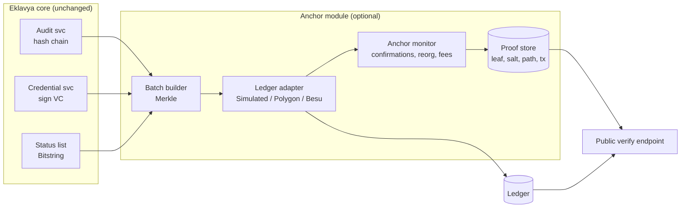
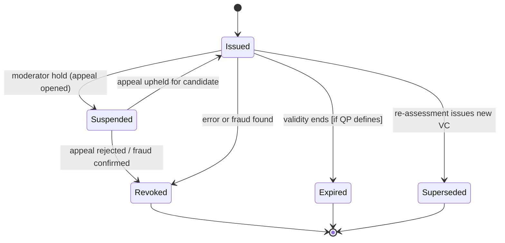
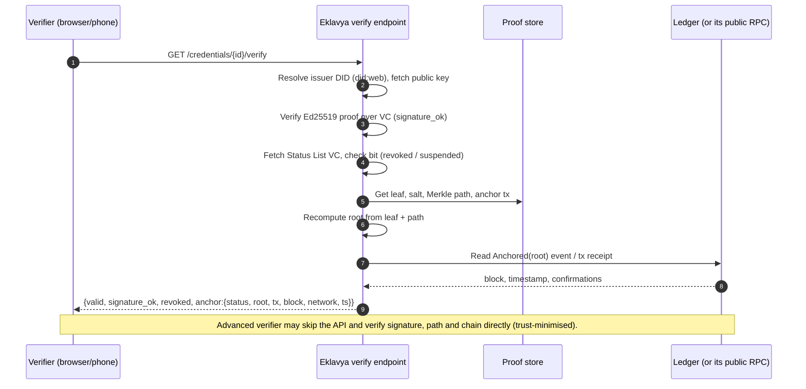

# 10 · Blockchain Anchoring & Trust Layer (Optional)

> **Status: optional module, off by default.** Eklavya's integrity does not depend on any blockchain. The core already provides a hash-chained audit log (doc 04 §3.8, doc 06 §6) and Ed25519-signed Verifiable Credentials (doc 06 §5). This module adds one thing: **an independent, third-party-witnessed timestamp and revocation anchor**, so that tampering by *the operator itself* (or by a compromised database admin) becomes detectable by anyone. The hackathon demo ships a **simulated** anchor (see `demo/SPEC.md`, `POST /anchor/run`); the production design below is a pluggable adapter.

**Design stance in one line:** *Hashes, not data. Anchors, not a database. Optional, not mandatory. Human authority unchanged.*

---

## 1. What problem does anchoring solve (and what it does not)

| Question | Without anchoring | With anchoring |
|---|---|---|
| Was this credential signed by the issuer key? | Yes: Ed25519 signature check | Same |
| Can the operator silently rewrite history (edit audit rows, backdate a decision, re-sign) and re-compute the hash chain? | **Possible** for anyone holding DB + signing key: a hash chain is self-consistent after a full rewrite | **Detectable**: the head hash/Merkle root was committed to an external ledger at time *T*; a rewritten history cannot match |
| Did the credential exist no later than time *T*? | Only the operator's word | Ledger block timestamp is a third-party witness |
| Is the credential revoked? | Status list hosted by the operator | Status-list digest/revocation entry is externally timestamped; operator cannot hide a revocation *after* it was recorded [Assumption: the verifier checks the registry directly] |
| Are candidate's personal data protected? | DPDP controls (doc 07) | Unchanged; chain holds no personal data (§3) |
| Does it make assessment *more accurate or fair*? | n/a | **No.** Anchoring proves integrity and time, not correctness. |

Anchoring is therefore a **tamper-evidence and non-repudiation** feature. It is not a data store, not a payment system, and not a decision-maker.

---

## 2. Why not "full blockchain"?

| Concern | Full-blockchain design (data/logic on-chain) | Eklavya: PostgreSQL + signed VC + optional anchor |
|---|---|---|
| **DPDP Act 2023** (erasure, correction, purpose limitation) | Immutable ledger conflicts with erasure/correction rights; personal data on-chain is effectively un-erasable | Personal data stays in erasable off-chain stores; chain holds only salted digests |
| **Latency & offline** | Needs connectivity and block confirmation; unusable in the field | Offline-first PWA unchanged; anchoring is a deferred batch job |
| **Cost & throughput** | Per-write gas / validator infrastructure for every response, evidence item and audit event | One transaction per batch (hundreds to thousands of events) |
| **Media size** | Videos/photos cannot be stored on-chain; off-chain pointers add no trust without hashes anyway | Evidence SHA-256 already in the audit chain; anchor commits to it transitively |
| **Governance** | Who runs validators? Who upgrades contracts? Who is liable? Unclear for a government-backed credential | Issuing authority (SSC/NSDC) keeps legal control; chain is only a witness |
| **Key loss / user wallets** | Low-literacy users cannot manage wallets/seed phrases | Users never touch a wallet; a QR/URL is enough |
| **Right to correct mistakes** | Wrong record permanent | Errors fixed by superseding/revoking credentials (status list), originals remain auditable |
| **Complexity & attack surface** | Smart-contract bugs, bridge/oracle risks, key custody | Tiny contract (append-only anchor + revocation registry) or none |
| **AI invariant** | Smart contracts cannot judge competence | Human assessor signs; chain never decides |

Conclusion: **use a database for data, cryptography for authenticity, and a ledger only for a witnessed timestamp and revocation.** If a judge asks "why not blockchain for everything?", the answer is: *the data that matters is personal, mutable-by-law, large and offline-created; the thing blockchain is uniquely good at, an append-only public timestamp, needs about 32 bytes per batch.*

---

## 3. What goes on-chain: and what never does

### 3.1 Allowed on-chain payloads
| Payload | Size | Purpose |
|---|---|---|
| `merkleRoot` (bytes32) of a batch of leaves | 32 B | Commit to many events/credentials at once |
| `batchId`, `leafCount` | ~16 B | Ordering and sanity |
| `kind` (audit-batch / credential-batch / status-list) | 1 B | Domain separation |
| `issuerId` (an opaque registered issuer id, not a person) | 32 B | Which authority anchored |
| Revocation entry: `credHash` (salted) + `reasonCode` | 33 B | Revocation registry (§6) |

### 3.2 Never on-chain (hard rule, enforced by an allow-list in the anchor service)
Names, phone numbers, Aadhaar or any ID number, DOB, addresses, photos/videos/audio, transcripts, scores or per-NOS results in clear, assessor identity, QP/NOS details linked to a person, free-text of any kind, unsalted hashes of low-entropy fields.

### 3.3 Leaf construction (prevents guessing and linkage)
```
leaf = SHA256( 0x00 || domain_tag || canonical_json(minimal_record) || salt )     // 0x00 = leaf prefix
node = SHA256( 0x01 || left || right )                                           // 0x01 = interior prefix
```
- `salt` = 128-bit random per leaf, stored **off-chain** with the credential/event. Without the salt the leaf is not guessable even if the record is low-entropy (e.g., a pass/fail on a known QP).
- Domain tags (`eklavya/audit/v1`, `eklavya/vc/v1`) and leaf/interior prefixes prevent second-preimage and cross-domain confusion.
- `minimal_record` for a credential = `{vc_id, issuer_did, issued_at, vc_digest}` where `vc_digest` is the digest of the signed VC; no subject attributes.
- Merkle tree is binary, last odd node promoted (not duplicated) to avoid the duplicate-leaf ambiguity.

```mermaid
flowchart TB
  subgraph Offchain["Off-chain (India region, erasable, DPDP scope)"]
    A[Audit events\nhash-chained] --> L1[leaf = H(0x00,tag,event,salt)]
    C[Signed VCs] --> L2[leaf = H(0x00,tag,vc_digest,salt)]
    L1 --> M[Merkle tree builder\nbatch every N events or T minutes]
    L2 --> M
    M --> R[Merkle root + proofs\nstored with each record]
  end
  R -- "root only (32 B)" --> Q[Anchor adapter\nqueue, retry, fee mgmt]
  Q --> CH[(Ledger: permissioned\nor public testnet)]
  CH -- "tx hash, block, timestamp" --> Q
  Q --> R
```

### 3.4 DPDP Act compatibility
Facts and our reading (this is **design analysis, not legal advice** — confirm with counsel and MeitY guidance before production **[Verify]**):

| DPDP concern | How the design handles it |
|---|---|
| Is a salted hash "personal data"? | Conservative stance: treat the digest as potentially linkable **while the salt and record exist**. Mitigations: salted, no identifiers, one leaf among many in a Merkle batch, and only the **root** is public. [Assumption: a root over many salted leaves is not personal data; confirm] |
| Right to erasure (Sec. 12) | Delete the record **and its salt** off-chain. The leaf can no longer be reproduced or linked; the root remains but is meaningless without leaves. Revocation entries use `credHash` of the VC id + salt, same treatment. |
| Right to correction | Corrected data produces a *new* credential; the old one is revoked/superseded. Nothing on-chain is edited. |
| Purpose limitation & consent | Anchoring is disclosed in the consent notice as "an integrity fingerprint is recorded on an external ledger; no personal data is recorded". Consent notice text is multilingual with audio read-out (doc 12). Anchoring of audit hashes is arguably part of security safeguards (Sec. 8(5)) [Verify]; credential anchoring is opt-in per candidate. |
| Data localisation / cross-border | Only non-personal roots leave India infrastructure if a public chain is used. Prefer permissioned chain hosted in India for production **[Assumption]**. |
| Breach notification | A leaked root/tx is not a data breach by itself; incident runbook still logs it. |
| Children | No special handling needed; no child data on-chain. |

Primary source: [Digital Personal Data Protection Act, 2023 (MeitY / India Code)](https://www.meity.gov.in/) and the DPDP Rules, 2025 (notified Nov 2025 with phased commencement; full obligations about 18 months later, i.e., around May 2027, per secondary summaries such as [Legal500](https://www.legal500.com/intelligence/india/privacy/from-draft-to-reality-key-changes-in-indias-dpdp-rules-2025)) **[Verify against Gazette text]**.

---

## 4. Which ledger? Options compared

| Option | Description | Pros | Cons | Fit |
|---|---|---|---|---|
| **A. No chain** (default) | Hash chain + signed VC + status list | Simplest, zero cost | Operator can rewrite history undetectably after the fact (§1) | MVP baseline |
| **B. Simulated ledger (demo)** | Local append-only chain with Merkle roots, fake tx ids (`demo/SPEC.md`) | Zero dependencies, deterministic demo, shows the full flow | Not a real witness; must be labelled "simulated" | Hackathon |
| **C. Public testnet: Polygon Amoy** | EVM testnet (chain id 80002, POL gas token, Sepolia-anchored; replaced Mumbai in 2024) | Free test gas, real explorer links, real block timestamps, zero ops | Testnets can be reset/deprecated; **not a legal-grade witness**; no SLA | Pilot proof-of-concept |
| **D. Public mainnet (Polygon PoS / L2)** | Production public EVM | Strong external witness, anyone can verify | Cost, token volatility, cross-border, reputational/regulatory perception **[Verify]** | Phase 4 optional |
| **E. Permissioned ledger (Hyperledger Besu/Fabric, or an India-hosted consortium)** | Validators run by NSDC, SSCs, NIC/MeghRaj, auditors | India-resident, predictable cost, governance fits Skill India structure; consortium independence gives witness value | Ops burden; weaker "anyone can verify" unless a public gateway/periodic public anchor is added | **Recommended production** |
| **F. Hybrid** | Permissioned chain for daily anchors + periodic (e.g., weekly) checkpoint of its head to a public chain | Low cost + public witness + residency | Two systems | Best long-term |

**Recommendation:** B for the hackathon demo, C for a pilot proof-of-concept (explicitly labelled testnet), E or F for production under issuing-authority governance. The adapter interface (§9) makes this a configuration change.

Related facts: Polygon Amoy replaced Mumbai after Goerli's deprecation; see [Polygon announcement](https://x.com/0xPolygonFdn/status/1745914946079056095) and [thirdweb note](https://blog.thirdweb.com/goodbye-mumbai-hello-amoy/). Testnet parameters can change **[Verify before use]**.

---

## 5. Architecture



Contract surface (EVM illustration; deliberately tiny, no personal data, no upgradability tricks beyond a timelocked issuer allow-list):
```solidity
// SPDX-License-Identifier: Apache-2.0   (illustrative, unaudited)
contract EklavyaAnchor {
    event Anchored(bytes32 indexed root, uint64 indexed batchId, uint8 kind, uint32 leafCount, uint64 ts);
    event Revoked(bytes32 indexed credHash, uint8 reason, uint64 ts);
    mapping(address => bool) public issuer;            // allow-list managed by multisig/timelock
    function anchor(bytes32 root, uint64 batchId, uint8 kind, uint32 leafCount) external onlyIssuer { ... }
    function revoke(bytes32 credHash, uint8 reason) external onlyIssuer { ... }
    function isRevoked(bytes32 credHash) external view returns (bool);
}
```
Events (logs) are cheaper than storage; `isRevoked` may use a mapping if on-chain read by other contracts is needed. Any production contract requires an independent audit **[Verify]**.

---

## 6. Revocation registry

Credentials can need revocation: assessor fraud discovered on appeal, impersonation, issuance error, expired validity, QP version withdrawn.

| Layer | Mechanism | Privacy |
|---|---|---|
| **Primary (always)** | **W3C Bitstring Status List** referenced from the VC's `credentialStatus` (VC 2.0 ecosystem). Large list, each credential has an index; list is published as a signed VC. Candidates are indistinguishable inside the bitstring (herd privacy). | No per-person identifier exposed |
| **Anchor of list** | Digest of the current status list VC is included as a leaf in each anchor batch, so the operator cannot show a verifier an older list without detection | Digest only |
| **Optional on-chain registry** | `revoke(credHash, reason)` with `credHash = H(vc_id || salt)`; verifier with the VC knows vc_id and salt (embedded in the QR payload) and can query | Salted; no identifiers |

Revocation workflow (human-governed): appeal board or moderator proposes -> **two-person approval** (lead assessor + SSC officer) [Assumption] -> status bit flipped + audit event + (optional) registry tx -> candidate and employers notified -> verification page shows "Revoked on <date>, reason class" (no reason detail). Revocation never deletes the credential record; it remains for appeal/legal hold.


`Suspended` uses the status-list `suspension` purpose; `Revoked` is irreversible by design (issue a new credential instead).

---

## 7. Verification flow

Verifier (employer, SSC, training partner) scans the QR (it carries a short verify URL plus the credential id and salt; no personal data in the URL beyond an opaque id).



Verification result states (shown with plain-language labels in EN/HI):

| State | Meaning | UI |
|---|---|---|
| Valid, anchored | Signature OK, not revoked, root confirmed on ledger | Green tick, "Verified, witnessed on <date>" |
| Valid, anchor pending | Signature OK, batch not yet confirmed (offline/ledger down) | Green tick + amber "Witness pending", still **valid** |
| Valid, anchor unavailable | Ledger unreachable at check time | Amber note; verification does not fail |
| Revoked / Suspended | Status bit set | Red, reason class |
| Invalid | Signature fails or proof/root mismatch | Red, "do not trust" and report link |

Key principle: **anchor status never makes a legitimately signed credential invalid**; it only upgrades or downgrades the *confidence level*. This is what makes "chain is down" a non-event (§10 and doc 09).

### 7.1 Auditor flow (insider-tamper detection)
Auditor downloads a segment of the audit chain, recomputes the hash chain and Merkle roots, and compares each root to the ledger event for that batch. Any rewritten event changes the root -> mismatch -> alarm. A scheduled **anchor reconciler** does this daily and raises an incident on mismatch.

---

## 8. Cost model

All figures are **order-of-magnitude [Assumption]**; gas, token price and INR rate vary. Re-measure on the chosen network.

Assumptions: 1,000,000 credentials/year; 1 anchor transaction per batch; each batch holds up to 5,000 leaves or 15 minutes, whichever first (audit batches) and credential batches hourly; ~60,000 gas per anchor tx (one event + small storage) [Assumption]; ~30 gwei and POL ≈ ₹10 as a placeholder price [Assumption; do not quote].

| Scenario | Tx/year | Gas/year | Indicative cost | Note |
|---|---|---|---|---|
| Simulated (demo) | 0 real | 0 | ₹0 | Local file/db |
| Polygon Amoy testnet | ~35,000 | free faucet POL | ₹0 | Not legal-grade |
| Public PoS mainnet, hourly + audit batches | ~35,000 | ~2.1 B gas | well below ₹1–2 lakh/year at the placeholder price **[Verify]** | <₹0.2 per credential |
| Permissioned (3-4 validator nodes, India cloud) | n/a | n/a | node hosting dominates: ~₹3-8 lakh/year **[Assumption]** | Predictable |
| Hybrid (permissioned + weekly public checkpoint) | +52 public tx | negligible | permissioned cost + <₹5,000 | Recommended |

Batching is the cost lever: cost per credential falls roughly linearly with batch size, while *verification latency of the anchor* rises. Credential issuance itself never waits for the chain.

---

## 9. Implementation details

### 9.1 Adapter interface (matches `demo/app/anchor.py` conceptually)
```python
class LedgerAdapter(Protocol):
    name: str                      # "simulated" | "polygon-amoy" | "besu-consortium"
    def submit(self, root: bytes, kind: str, batch_id: int, leaf_count: int) -> TxRef: ...
    def status(self, tx: TxRef) -> Literal["pending","confirmed","failed","reorged"]: ...
    def read_anchor(self, root: bytes) -> AnchorRecord | None: ...
    def revoke(self, cred_hash: bytes, reason: int) -> TxRef: ...
    def is_revoked(self, cred_hash: bytes) -> bool: ...
```

### 9.2 Anchor job (idempotent)
```
every T minutes or N pending leaves:
   leaves = SELECT unanchored ORDER BY seq LIMIT N
   if empty: return
   root, paths = merkle(leaves)
   batch = INSERT anchor_batch(root, kind, leaf_count, status='building')   -- unique(root)
   tx = adapter.submit(root, ...)       -- retry w/ exponential backoff; nonce & fee bump; idempotent on root
   UPDATE anchor_batch SET tx=tx, status='pending'
   monitor: wait K confirmations -> 'confirmed' (K=12 public chain, K=1 permissioned BFT) [Assumption]
            if reorged: resubmit (same root)
   write proof rows (leaf_id, batch_id, path) -> proof store
```
New tables (see doc 06 §2.1): `anchor_batch`, `anchor_proof`, `credential_status`.

### 9.3 Key management
Anchor signer key in KMS/HSM, separate from the credential-signing key; multi-sig/timelock for issuer allow-list changes; key rotation procedure registered in the DID document and on-chain allow-list.

---

## 10. Failure modes: "what if the chain is down?"

| Failure | Effect | Handling |
|---|---|---|
| Ledger/RPC unreachable | Anchors not confirmed | Queue grows; retry with backoff; issuance, assessment, verification continue; verification shows "witness pending" |
| Gas spike / fee failure | Tx stuck | Fee bump, cap, or defer batch; permissioned chain has no fee market |
| Reorg of a public chain | Anchor tx dropped | Monitor waits for confirmations; resubmit same root |
| Testnet reset/deprecation | Anchors vanish | Testnet use is labelled "pilot, non-legal"; re-anchor roots on new network from proof store (roots are retained) |
| Anchor key compromise | Fraudulent anchors | Anchors only attest *integrity of roots Eklavya submits*; revoke key via multisig; reconcile roots vs. audit chain |
| Verifier offline | Cannot reach chain | Signature + embedded Merkle proof + cached status list still verify offline; chain check deferred |

---

## 11. DID / Verifiable Credential alignment

- **Credential format**: W3C Verifiable Credentials Data Model v2.0 (`https://www.w3.org/ns/credentials/v2`). VC 2.0 reached W3C Recommendation status in 2025 **[Verify at the W3C site]**; reference: [W3C VC Data Model 2.0](https://www.w3.org/TR/vc-data-model-2.0/).
- **Issuer identifier**: `did:web:<issuer-domain>`, a DID method that resolves via HTTPS and fits government-controlled domains; the DID document lists verification keys and rotations. Alternative methods (`did:key` for offline demos, `did:ethr` if public chain is chosen) are possible **[Assumption]**.
- **Proof**: Data Integrity (`eddsa-rdfc-2022` / Ed25519) or JOSE/COSE-secured VC (SD-JWT-VC) for selective disclosure **[Verify the profile with the issuing authority]**. The doc 06 sketch uses `Ed25519Signature2020` as an early-stage illustration; production should use the current Data Integrity cryptosuite.
- **Selective disclosure**: candidate can show "Certified at NSQF L4 in QP X" without scores (SD-JWT or BBS) **[Assumption: phase 3]**.
- **Subject identifier**: opaque `urn:` or holder DID; never Aadhaar.
- **Status**: `credentialStatus` of type `BitstringStatusListEntry`.
- **Evidence property**: VC `evidence` may reference a *hash* of the review packet, not the packet.
- **Wallet**: candidate keeps the VC in DigiLocker or a WhatsApp/PDF+QR fallback; no crypto-wallet required **[Proposed integration]**.
- **Anchor linkage**: the Merkle inclusion proof is attached in the VC's `evidence` or as a sidecar file so offline verifiers can validate against a ledger later.
- **Interoperability goals**: Open Badges 3.0 uses VC 2.0 and is a plausible export format for employers abroad **[Verify]**.

Related Indian context: the [National Credit Framework / NSQF under NCVET](https://ncvet.gov.in/) sets qualification structure; the issuing authority for certificates remains the SSC/NSDC/NCVET chain **[Verify governance]**.

---

## 12. Threat model for the anchoring module

STRIDE-style table (assets: audit integrity, credential authenticity, revocation freshness, privacy).

| # | Threat | Actor | Impact | Mitigation | Residual |
|---|---|---|---|---|---|
| T1 | Rewrite audit log and recompute chain | Insider/DBA | Hidden alterations | Periodic Merkle anchor; daily reconciler; auditors hold roots | Changes after last anchor, before next, are not yet witnessed (window = batch interval) |
| T2 | Backdate credential | Operator | False issuance time | Block timestamp of the anchoring tx | Resolution = batch interval |
| T3 | Forge credential | External | Fake certificate | Ed25519 signature, DID key; verify endpoint | Issuer key compromise (HSM, rotation, revocation) |
| T4 | Hide revocation | Operator | Revoked credential looks valid | Status list digest anchored; optional on-chain registry; verifier freshness window | Offline verifiers rely on cached list age (show "as of") |
| T5 | De-anonymise holders from chain data | Public observer | Privacy breach | Only roots/salted hashes; no identifiers; batching | Salts must be protected; leaks of salt + record link a leaf |
| T6 | Hash guessing (dictionary) | Public observer | Learn outcome | 128-bit random salt per leaf | None if salt secret |
| T7 | Anchor flooding / griefing | Anyone (public chain) | Cost/noise | `onlyIssuer` allow-list; rate limit | Chain-level congestion |
| T8 | Smart contract bug | Developer | Wrong registry state | Minimal contract, audit, no value held, can be replaced since truth is in VC+signature | Low |
| T9 | Chain reorg / 51% / validator collusion | Network | Anchors undone or censored | Confirmations; hybrid checkpoints; permissioned consortium with independent members | Low for hybrid |
| T10 | Anchor key theft | Attacker | Fake anchors | KMS/HSM, separate key, multisig for allow-list | Anchors do not authenticate credentials; signature still required |
| T11 | Misleading "blockchain-verified" marketing | Team | Trust inflation | UI says what is verified (signature, status, witness time), never "blockchain certified"; simulated mode watermark | Governance |
| T12 | Sanctions/regulatory change on public chain use | Policy | Service risk | Pluggable adapter; permissioned default for production | Policy [Verify] |
| T13 | AI decisions affecting anchor | Model | Wrongful certification | None on chain; AI cannot write decisions (doc 05) | Out of scope for chain |

**Non-goals:** the chain does not prove the assessment was *fair or correct*, that the evidence was authentic, or that the person presenting a credential is its subject (use ID checks, doc 07).

---

## 13. How the demo represents this
Per `demo/SPEC.md`: `POST /anchor/run` anchors the audit head and credential hashes into a **simulated permissioned ledger** (local append-only chain, Merkle root, fake tx ids and block numbers), and `GET /credentials/{id}/verify` returns `anchor:{status, tx, block, network}`. The UI must label the network "Eklavya-Anchor (simulated; pluggable Polygon/Amoy testnet)". The simulated mode implements the same leaf/salt/Merkle rules as §3.3 so the production adapter is a drop-in.

## 14. Phasing
| Phase | Anchoring scope |
|---|---|
| Demo | Simulated ledger |
| Pilot-ready (0-3 mo) | Leaf/Merkle/proof store hardened; adapter interface; status list |
| Pilot (3-6 mo) | Optional Polygon Amoy proof-of-concept, clearly labelled testnet |
| Integration (6-12 mo) | Permissioned consortium design with NSDC/SSC/NIC; legal review |
| Scale (12-24 mo) | Hybrid public checkpoint; auditor/third-party verifier SDK |

## 15. Sources
- W3C, [Verifiable Credentials Data Model v2.0](https://www.w3.org/TR/vc-data-model-2.0/) and Bitstring Status List **[Verify]** (site not reachable from the authoring environment; facts from prior knowledge)
- Polygon Foundation, [Amoy testnet announcement](https://x.com/0xPolygonFdn/status/1745914946079056095)
- [Legal500 on DPDP Rules 2025](https://www.legal500.com/intelligence/india/privacy/from-draft-to-reality-key-changes-in-indias-dpdp-rules-2025)
- [NCVET](https://ncvet.gov.in/), [NCVET RPL guidelines](https://ncvet.gov.in/wp-content/uploads/2023/08/Final-RPL-guidelines.pdf)
