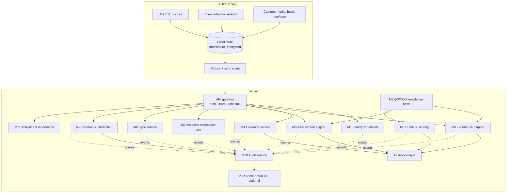
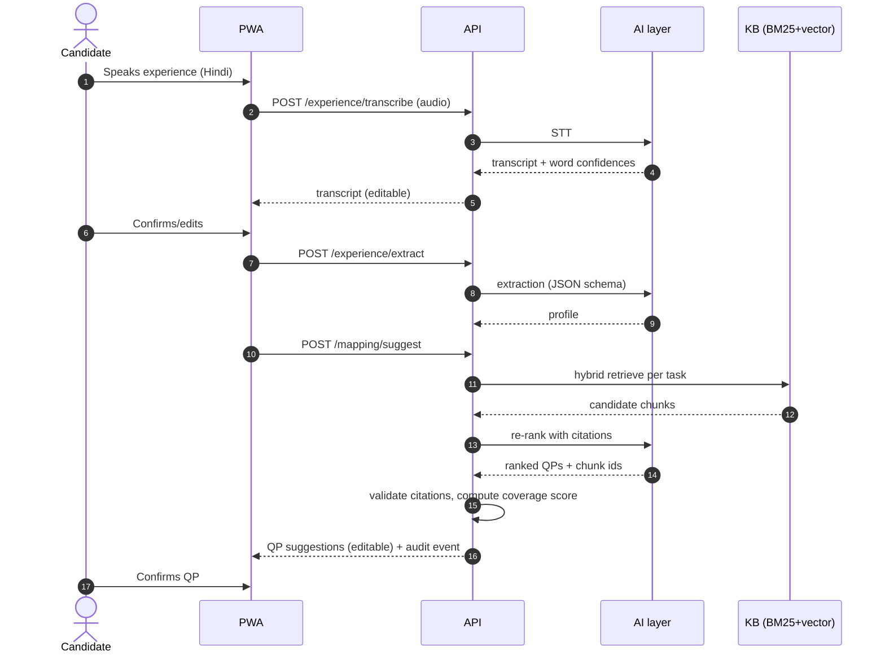
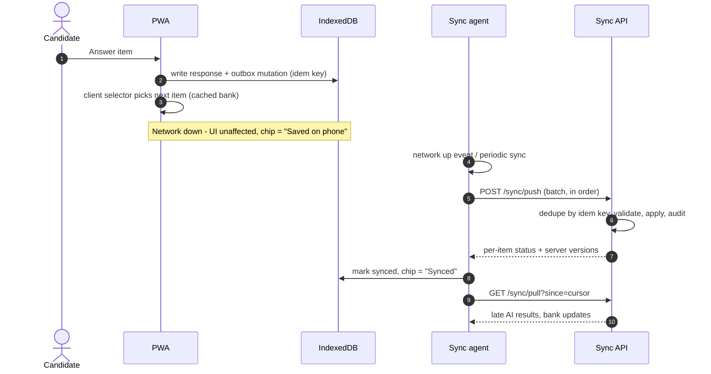
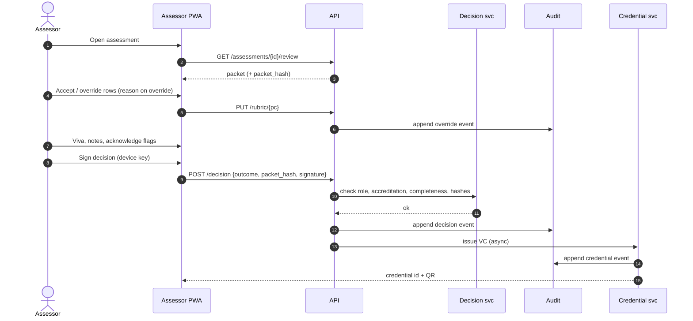
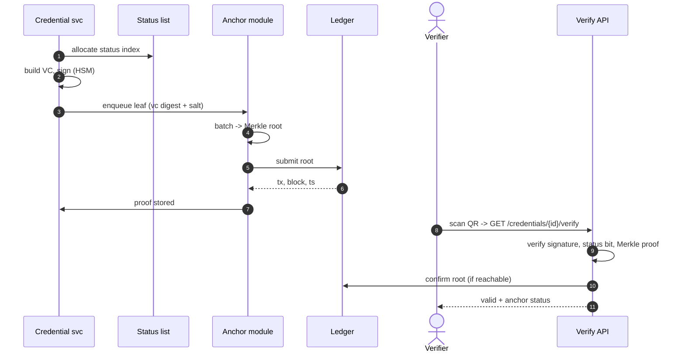
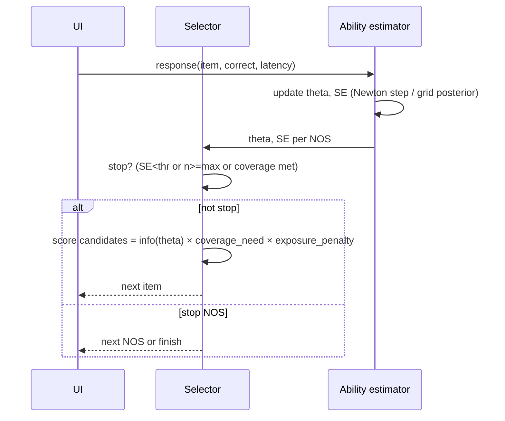
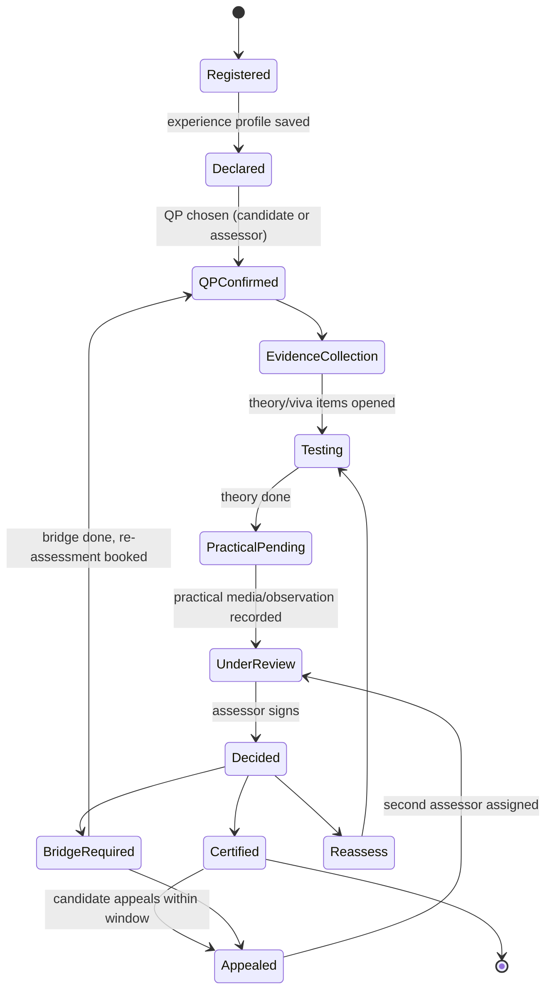
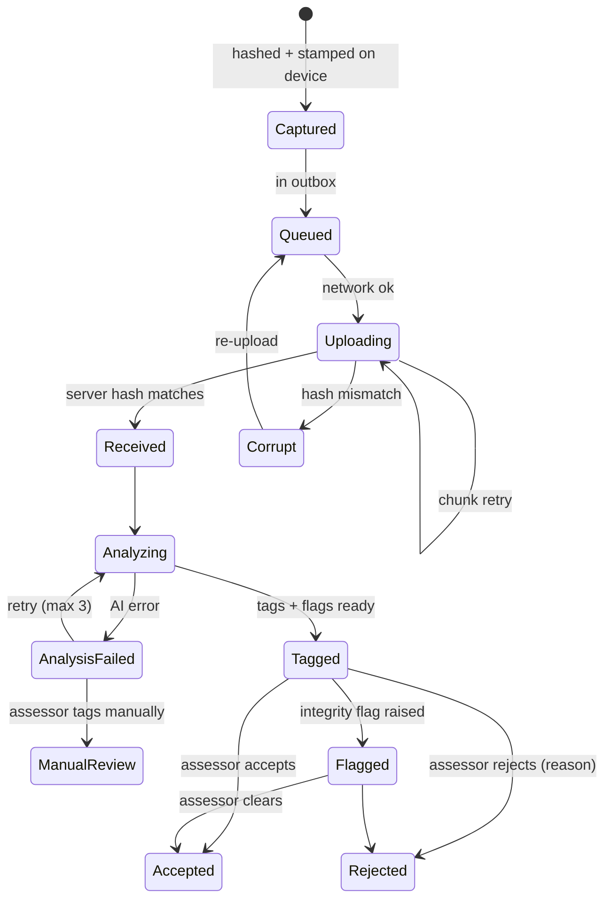
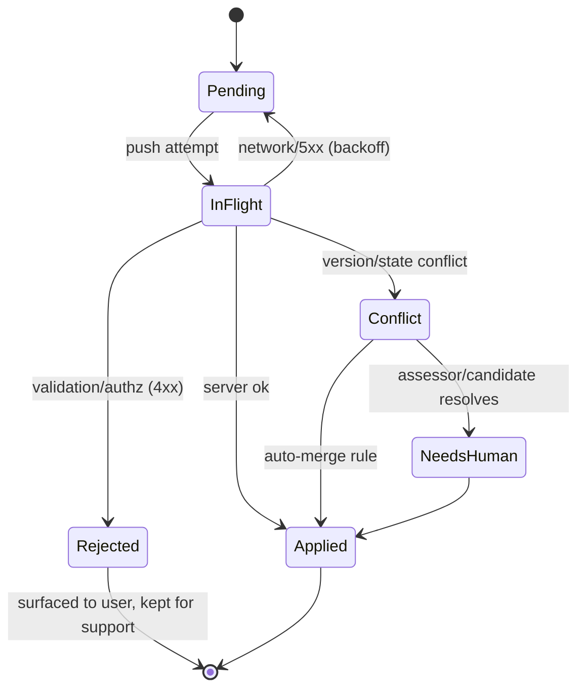

# 11 · Detailed Technical Design

Deep-dive companion to [04 architecture](04-system-architecture.md), [05 AI design](05-ai-and-assessment-design.md), [06 data & API](06-data-model-and-api.md) and [10 anchoring](10-blockchain-anchoring-and-trust.md). Everything numeric here is a **default, config-driven [Assumption]** unless stated; items needing authority confirmation are marked **[Verify]**.

## Contents
1. Design tenets and module map
2. Module designs (M1-M12)
3. Sequence diagrams
4. State machines
5. Algorithms with pseudo-code (adaptive engine/IRT, RAG mapping, scoring, inter-rater κ, sync conflict resolution, audit chain)
6. Error handling and degradation matrix
7. Configuration, feature flags, versioning
8. Capacity and performance budgets
9. Open design questions

---

## 1. Design tenets and module map

| Tenet | Engineering consequence |
|---|---|
| AI suggests, human decides | Separate types `AISuggestion` and `Decision`; DB constraint + API guard (§2 M9) |
| Offline-first | Every client write is a local event first; server is eventually consistent (§5.5) |
| Standards-grounded | Every score/question references `pc_id`; uncited AI claims rejected |
| Deterministic core, probabilistic edge | Scoring/adaptive/sync are deterministic, unit-testable; LLMs only produce typed suggestions |
| Config over code | Weights, thresholds, stop rules per QP in versioned config |
| Observable | Each AI call logs model, prompt version, latency, cost, schema-validity |



---

## 2. Module-by-module design

### M1 · Identity, roles & consent
| Aspect | Design |
|---|---|
| Responsibilities | OTP login, staff OIDC+MFA, role & accreditation claims, consent ledger, device binding |
| Data | `user_account`, `candidate`, `consent`, `assessor_accreditation(id, assessor_id, body, valid_from, valid_to, status)` |
| Candidate login | Mobile OTP (6 digits, 5 min TTL, 3 tries, 5 requests/hour/number, per-IP and per-device throttles); refresh token bound to device id |
| Assessor login | OIDC (state SSO or Keycloak) + TOTP; assessor device registers a key pair (WebCrypto non-extractable) for offline signing (§M9) |
| Authorization | RBAC + ABAC: `assessor` sees assessments where `assessment.assessor_id = sub` or in moderation sample; policy enforced in repository layer, not only controllers |
| Consent | Versioned, per purpose: `assessment`, `ai_processing`, `evidence_media`, `credential_anchoring` (opt-in), `research_analytics` (opt-in, de-identified). Notice shown in chosen language with audio read-out; a consent receipt stored; withdrawal API stops future processing and schedules erasure job |
| Failure modes | OTP SMS delayed -> voice-call OTP fallback [Assumption]; consent not given -> hard stop with explanation |

### M2 · QP/NOS knowledge base
- **Ingest pipeline**: official PDF/Excel -> text extraction -> structural parser (QP -> NOS -> PC/knowledge/skills) -> human curator review UI -> publish version. Chunks carry `{qp_code, nos_code, pc_code, is_core, is_critical, nsqf_level, version}`.
- **Versioning**: immutable `qp_version`; assessments pin to a version. Withdrawn/updated QPs generate re-mapping tasks, never silent changes.
- **Indexes**: BM25 (Postgres `tsvector` with language configs) + `pgvector` HNSW; multilingual embedding model [Assumption: e.g., an open multilingual E5/BGE class] with Hindi/English alias lexicon (e.g., "pankha" -> "fan").
- **Admin**: weights, thresholds, stop rules, critical flags editable with dual approval and audit.
- **Source authority**: QP/NOS text from NSQF/NQR and SSC portals [Verify licence/data-sharing].

### M3 · Experience mapper
Pipeline: STT -> normalise -> extraction (LLM, schema) -> retrieval -> re-rank -> QP candidates (algorithm §5.2).
| Step | Contract | Failure handling |
|---|---|---|
| STT | `audio -> {text, lang, word_conf[]}` | Low conf words highlighted for candidate edit; fall back to text |
| Extraction | JSON schema (doc 05 §2); max 2 retries on schema fail | Rule-based keyword extractor fallback |
| Retrieval | per-task query -> top-k (k=20) fused by RRF | If vector index down: BM25 only |
| Re-rank | LLM with `chunk_ids` only from retrieved set | Reject uncited; fall back to retrieval score ordering with "AI explanation unavailable" |
| Output | `AISuggestion(type=qp_mapping)` | Always editable by candidate/assessor |

### M4 · Evidence service
- **Capture (client)**: compress, compute SHA-256 over the *original* bytes before compression and over the stored bytes after (both recorded), EXIF/GPS/time, device id, monotonic clock offset.
- **Upload**: tus resumable; server re-hashes; mismatch => reject chunk set and re-request.
- **Analysis (async)**: OCR for docs -> field extraction; VLM for photos -> PC tags; video keyframes + audio STT -> step detection; integrity heuristics (perceptual hash dedupe within and across candidates, EXIF consistency, screen-recapture/moire heuristics, synthetic-media score [Assumption: heuristic only]).
- **Output**: `evidence_tag(pc_id, confidence, source)` and `flags[]`. Flags are advisory, never auto-reject.
- **Evidence weight** = `reliability(source) × recency(age) × specificity(PC match)`; defaults in §5.3.
- **Retention**: media encrypted with per-object DEK wrapped by KMS key; deletion by crypto-shredding.

### M5 · Assessment engine
- **Item bank service**: CRUD, states `draft -> sme_review -> active -> retired`; LLM-generated items enter `draft` only. Each item has `{pc_id, type, difficulty b, discrimination a (default 1), guess c (for MCQ), language variants, audio, media, key, rubric_keypoints, exposure_count}`.
- **Selector**: algorithm §5.1; deterministic with seeded RNG per assessment for reproducibility; runs on the server and, identically, in the client from a cached bank (shared TypeScript/Python test vectors).
- **Open-answer grader**: LLM against `rubric_keypoints`; returns `{matched[], missed[], confidence}`; confidence < 0.6 -> assessor queue.
- **Session integrity**: time-boxing, item variants, focus-loss events, repeated-voice-similarity signal (advisory).

### M6 · Rubric & scoring
Rubric rows generated from PCs; critical PCs `must_pass`. AI pre-fill suggestions; assessor final. Aggregation per §5.3. Outputs `nos_results`, `qp_score`, `outcome_recommendation`, `gaps`.

### M7 · Assessor workspace service
Builds the **review packet**: profile, evidence by NOS/PC, per-PC AI score + rationale + citations + confidence, flags, viva suggestions, theory results. Produces a *packet hash* included in the decision (so the signed decision is bound to exactly what was reviewed). Offline mode: packet is downloaded and cached encrypted.

### M8 · Sync service
Endpoints `/sync/push`, `/sync/pull`; per-entity merge strategy table (§5.5); idempotency table `idem(key, device_id, result_hash, created_at)` with 30-day TTL; cursor = monotonic server `change_seq`.

### M9 · Decision & credential service
| Rule | Enforcement |
|---|---|
| Only humans decide | `decision.actor_type` CHECK = 'human'; JWT `role=assessor` and active accreditation; AI service accounts have no DB grant on `decision` and no route |
| Review completeness | Cannot sign unless every critical PC has `final_score` and every flag is acknowledged |
| Binding | Decision includes `packet_hash`, `rubric_hash`, `policy_version` |
| Signature | e-sign: assessor's device key signs `H(decision_payload)`; server counter-signs on receipt; offline-signed decisions carry `signed_at_device` and are validated for skew [Assumption: ± 24 h tolerance flagged] |
| Credential | VC issued under issuer key in HSM/KMS only **after** decision; status list index allocated; optional anchor leaf (doc 10) |
| Appeals | Appeal creates `appeal` linked to decision; second assessor assigned (not the original); outcome may supersede |

### M10 · Audit service
Append-only `audit_event`, hash chain (§5.6), one chain per tenant partition + global head. Writes happen in the same DB transaction as the business change (transactional outbox). Immutable by DB role (no UPDATE/DELETE grant) and verified by a nightly job; optional Merkle anchor (doc 10).

### M11 · Analytics & moderation
Materialised views refreshed hourly: throughput, time-to-certify, pass rates, override rates, agreement metrics (§5.4), bias parity. Moderation sampling: stratified (by assessor, QP, region) at 10% [Assumption] plus risk-based oversampling (new assessors, outlier pass rates, high AI-human disagreement).

### M12 · Anchor module (optional)
Defined in doc 10: batch builder, ledger adapter, proof store, monitor, status list.

### AI service layer
| Concern | Design |
|---|---|
| Provider interface | `complete(task, schema, inputs) -> typed output` with adapters: hosted LLM, self-hosted open model, deterministic stub |
| Prompt registry | Versioned templates with golden tests; prompt version stored on each suggestion |
| Guardrails | Delimited untrusted inputs; JSON schema validation; citation check against retrieved chunk ids; PII redaction before external calls; max token & cost budgets per candidate |
| Caching | Retrieval caches by normalised task string; embeddings cached; LLM outputs cached by (prompt_version, input hash) |
| Cost control | Small model for extraction/routing; larger for re-rank/rationale only when top-2 scores within margin |
| Observability | `ai_call_log(model, prompt_version, latency_ms, tokens, cost, schema_ok, cite_ok)` |

---

## 3. Sequence diagrams

### 3.1 Declare -> map (online)


### 3.2 Offline assessment and sync


### 3.3 Assessor review and e-sign


### 3.4 Credential issue, anchor and verify


### 3.5 Adaptive item selection (per response)


---

## 4. State machines

### 4.1 Assessment lifecycle


### 4.2 Evidence item


### 4.3 Sync mutation


### 4.4 Credential status
See doc 10 §6 (Issued, Suspended, Revoked, Expired, Superseded).

### 4.5 AI suggestion
`Created -> Validated (schema+citations) -> Shown -> Accepted | Overridden | Ignored`. `Created -> Rejected(system)` when validation fails; rejected suggestions are logged but never shown.

---

## 5. Algorithms

### 5.1 Adaptive engine (IRT-inspired)

**Model.** For item *i* with difficulty *b_i*, discrimination *a_i* (default 1.0), guessing *c_i* (0.25 for 4-option MCQ, 0 otherwise), the probability that a candidate with ability θ answers correctly (3PL, reduces to 1PL/Rasch when a=1, c=0):

```
P_i(θ) = c_i + (1 - c_i) / (1 + exp(-a_i (θ - b_i)))
I_i(θ) = a_i² · ((P_i - c_i)² / (1 - c_i)²) · ((1 - P_i) / P_i)       # Fisher information (3PL)
SE(θ)  = 1 / sqrt( Σ I_i(θ) )
```
Difficulty levels 1-5 map to b ∈ {-2,-1,0,1,2} **[Assumption]**. In the MVP, with few responses and uncalibrated items, a **Elo-style 1PL update** is used; calibration with real pilot data (§ doc 13) replaces defaults (e.g., fit 2PL/3PL with a Bayesian prior).

**Ability estimation (per NOS)**: Expected-A-Posteriori on a grid, robust with few items:
```python
GRID = [-4 + 0.1*k for k in range(81)]
PRIOR = normal_pdf(mu=0, sd=1.5)        # weakly informative; mu may start from declared experience (see below)

def update_posterior(post, item, correct):
    for k, th in enumerate(GRID):
        p = P(item, th)
        post[k] *= p if correct else (1 - p)
    normalise(post)

def estimate(post):
    theta = sum(th * w for th, w in zip(GRID, post))
    se = sqrt(sum(w * (th - theta)**2 for th, w in zip(GRID, post)))
    return theta, se
```
**Prior personalisation [Assumption]:** μ0 = clamp(0.15·min(years, 10) - 1.0, -1, 0.5) — modest tilt from self-declared years, small enough that evidence dominates. Disclosed in assessor view; fairness review required (§ doc 05 §9) because it uses a self-declared input.

**Selection** (per NOS in priority order of lowest coverage):
```python
def next_item(state, nos):
    if stop(state, nos): return None
    theta, se = estimate(state[nos].post)
    cands = [it for it in bank[nos] if it.status=='active' and it.id not in state.seen
             and it.lang in state.langs and content_ok(it, state)]
    def score(it):
        info = fisher_info(it, theta)
        need = 1.0 + 0.5*uncovered(state, it.pc_id)          # favour PCs not yet covered
        expo = 1.0 / (1.0 + it.exposure_count / EXPO_K)      # Sympson-Hetter-style soft control
        return info * need * expo
    top = sorted(cands, key=score, reverse=True)[:5]          # "randomesque" to limit overexposure
    return rng(state.seed, state.n).choice(top)

def stop(state, nos):
    s = state[nos]
    if s.n >= MAX_ITEMS(nos):                      return True      # default 12
    if s.n >= MIN_ITEMS(nos) and s.se < SE_THR:    return True      # default MIN=5, SE_THR=0.45
    if critical_pcs_uncovered(state, nos) and s.n < MAX_ITEMS(nos): return False
    return not any(cands)
```
**Content balancing:** at least one item per *critical* PC where the bank allows; max 2 consecutive items of the same type; image/audio items prioritised for low-literacy mode.
**Cold start:** first item difficulty 3 (θ=0). **Fatigue guard:** after 25 total items prompt a break; save state.
**Determinism & parity:** server and client implement the same function; test vectors (seed, responses -> next item ids) in CI guarantee identical behaviour offline/online.
**Safety:** adaptive output is a *theory estimate* feeding a score. Pass/fail never derived from θ alone (§5.3). Items with out-of-range stats flagged for SME review (differential item functioning analysis, §5.6 of doc 13).

**Elo-style MVP update** (no calibration data):
```
expected = 1/(1+exp(-(theta - b)))
theta += K * (correct - expected)        # K = 0.6 early, decays to 0.2: K = max(0.2, 0.6 / sqrt(n))
b_item (offline calibration only) -= K_i * (correct - expected)    # updated in batch, never live
```

### 5.2 RAG mapping: retrieval, fusion, coverage score
```python
def map_to_qp(profile, kb, llm):
    queries = [render(t) for t in profile.tasks] + [profile.occupation_guess]
    per_task = {}
    for q in queries:
        bm = kb.bm25(q, k=30)
        vec = kb.vector(embed(q), k=30)
        per_task[q] = rrf_fuse(bm, vec, k=60)[:20]         # Reciprocal Rank Fusion: score = Σ 1/(60 + rank)
    # Aggregate chunk hits by QP: weighted by chunk's NOS core flag and retrieval score
    qp_scores = defaultdict(float)
    for q, hits in per_task.items():
        for h in hits:
            w = 0.7 if h.nos.is_core else 0.3
            qp_scores[h.qp] += w * h.score
    shortlist = top(qp_scores, 5)

    results = []
    for qp in shortlist:
        evidence_chunks = collect(per_task, qp, limit=12)
        out = llm.rerank(task="qp_fit", profile=profile, qp=qp, chunks=evidence_chunks, schema=QP_FIT)
        # citations must be a subset of evidence_chunks ids
        if not set(out.cited_chunk_ids) <= {c.id for c in evidence_chunks}:
            log_reject(out); out = fallback_from_retrieval(qp, evidence_chunks)
        cov = coverage(profile, qp)         # share of QP's core/non-core PCs plausibly matched
        conf = 0.5*sigmoid(z(qp_scores[qp])) + 0.3*cov + 0.2*out.llm_conf   # weights [Assumption], calibrated in pilot
        results.append(Suggestion(qp, out.matched_nos, out.matched_pc, conf, out.rationale, out.cited_chunk_ids))
    return sorted(results, key=lambda r: r.conf, reverse=True)

def coverage(profile, qp):
    core = [p for p in qp.pcs if p.nos.is_core]; non = [p for p in qp.pcs if not p.nos.is_core]
    mc = matched(core, profile)/len(core); mn = matched(non, profile)/len(non)
    return 0.7*mc + 0.3*mn
```
- **Level suggestion**: from `supervision_level`, team lead/training/estimation cues vs. NSQF level descriptors (process, professional knowledge, professional skill, core skill, responsibility). Output both the best-fit and one level below as "safe" option; assessor chooses.
- **Calibration**: confidence mapped by isotonic regression on the golden set so that "0.85" means ≈85% top-1 correct [Assumption].
- **Refusal behaviour**: if top confidence < 0.4, show "We could not match confidently; assessor will help" rather than a weak guess.

### 5.3 Scoring (theory, practical, evidence, aggregation)

**Theory score per NOS** (0-100):
```
theory_i = 100 * sigmoid_scale(theta_i)  where sigmoid_scale(θ) = 1/(1+exp(-1.2·θ))   # maps -2..2 to ≈8..92
# plus raw % correct on critical-knowledge items shown separately for the assessor
```
**Practical score per NOS** from rubric rows, scale 0-3 per PC, weights *w_pc* (default equal; critical PCs weight 2):
```
practical_i = 100 * Σ(w_pc * s_pc) / (3 * Σ w_pc)
critical_fail_i = any(pc.critical and s_pc < 2)       # "Competent" required for each critical PC
```
**Evidence score per NOS**:
```
evidence_i = 100 * min(1, Σ_e weight(e) * match(e, pc) over PCs of NOS / target_i )
weight(e) = reliability(source) × recency(e) × specificity(e)
reliability: employer-attested document 1.0 · system-captured media with geo/time 0.8 · uploaded document unverified 0.5 · self-declared 0.2     [Assumption]
recency = exp(-age_years / 5)            specificity ∈ [0.3, 1] by PC-level match confidence
```
**NOS score & result**:
```
NOS_score_i = w_t·theory_i + w_p·practical_i + w_e·evidence_i         (0.25 / 0.50 / 0.25 default) [Assumption]
NOS_result_i = Competent  iff  NOS_score_i >= T_nos  and not critical_fail_i  and practical_present_i
                       else NotYetCompetent
QP_score = 0.70 * mean(NOS_score of core) + 0.30 * mean(NOS_score of non-core)        # per RPL guidelines [Verify per QP]
Outcome (recommendation) =
   Certified           if QP_score >= T_qp and all core NOS Competent
   BridgeRequired(gap) if some NOS NotYetCompetent and bridge feasible
   Reassess            if evidence insufficient or flags unresolved
```
Defaults T_nos = 60 [Assumption], T_qp = 70 [Verify per SSC; NSQF material cites 70% aggregate]. If a practical component is missing for a NOS, the NOS cannot be Competent (practical required). Result is a **recommendation**; the assessor's signed Decision is authoritative.

**Gap & bridge planning**:
```
for NOS in NotYetCompetent: gaps = PCs with s_pc<2 or low coverage
  modules = bridge_catalog.match(gaps)  # set cover, minimise hours
  plan.hours = Σ module.hours  (cap and align with the documented ~68 h bridge reference [Verify])
```

**Score explanation object** for each row: `{inputs, weights, formula_version, citations}` so any number can be reproduced.

### 5.4 Inter-rater agreement (κ, weighted κ, ICC)

Used on moderation samples where two assessors (or assessor vs moderator vs AI) rate the same candidate-PC.

**Cohen's κ (nominal, e.g., Competent / NYC):**
```python
def cohens_kappa(r1, r2, cats):
    n = len(r1)
    po = sum(a == b for a, b in zip(r1, r2)) / n
    pe = sum((r1.count(c)/n) * (r2.count(c)/n) for c in cats)
    return (po - pe) / (1 - pe) if pe < 1 else 1.0
```
**Weighted κ (ordinal rubric 0-3, quadratic weights):**
```python
def weighted_kappa(r1, r2, k=4):
    O = confusion_matrix(r1, r2, k)/n          # observed
    E = outer(marginals(r1), marginals(r2))     # expected
    W = [[((i-j)/(k-1))**2 for j in range(k)] for i in range(k)]
    return 1 - sum(W*O) / sum(W*E)
```
**ICC(2,1)** for continuous NOS scores across multiple raters (two-way random, absolute agreement):
```
ICC(2,1) = (MSR - MSE) / (MSR + (k-1)·MSE + k·(MSC - MSE)/n)
```
**Reporting**: κ per NOS, per assessor pair, and *AI-vs-human* (to monitor suggestion quality, not to replace humans); bootstrap 95% CI (1,000 resamples); minimum n=30 pairs before showing a number, else "insufficient data". Interpretation bands (Landis-Koch) are guidance only. Target κ ≥ 0.75 [Assumption, from doc 08].
**Drift detection:** rolling 4-week κ vs baseline; CUSUM on override-rate and mean-score-minus-moderator; alert if |Δ| > 2σ. **Collusion/leniency**: assessor pass-rate z-score vs peers controlling for QP, plus pattern checks (identical rubric vectors, ultra-short review times).
**Prevalence caveat:** κ is unstable when almost all ratings are "Competent"; also show raw agreement and Gwet's AC1 [Assumption].

### 5.5 Sync and conflict resolution

**Entity strategy table**
| Entity | Writer | Strategy | Conflict handling |
|---|---|---|---|
| `item_response` | Candidate device | Append-only, idempotent on `(assessment_id,item_id,attempt_no)` | Duplicate => return original; late response after assessment closed => store, flag |
| `evidence` | Candidate/assessor | Append-only; media by hash | Same hash => dedupe link; different content same id => reject and re-id |
| `experience_profile` | Candidate, assessor | Field-level 3-way merge (base, local, remote) | Same field changed both sides => `NeedsHuman` (assessor chooses; both retained) |
| `rubric_score` | Assessor | Per-PC row version; optimistic concurrency `if_version` | Two assessors => second gets 409 with both values; moderator resolves |
| `decision` | Assessor | **Server-authoritative**, write-once | Second decision rejected unless via appeal flow |
| `audit_event` | System | Append-only, server assigns sequence | Client events are wrapped as `client_event` with device hash; server chain is canonical |
| `consent` | Candidate | Append-only ledger; latest by server time wins, withdrawal always wins | n/a |
| Reference data (QP, items) | Admin | Server -> client pull only | Client pinned to version; no client writes |

**Push algorithm (server)**
```python
def apply_push(batch, device, user):
    results = []
    for m in sorted(batch, key=lambda m: m.client_seq):      # preserve causal order per device
        if idem.exists(m.idem_key):                          # exactly-once effect
            results.append(idem.result(m.idem_key)); continue
        try:
            authorize(user, m); validate(m)
            with tx():
                res = HANDLERS[m.type](m, device)            # may return Conflict(local, remote, base)
                audit.append(event_for(m, res))
                idem.store(m.idem_key, res)
        except ValidationError as e: res = Rejected(e)
        results.append(res)
    return results
```
**Client outbox**: strictly ordered per entity; exponential backoff with jitter (1s, 2s, 4s ... cap 5 min); poison-mutation quarantine after 8 attempts with user-visible "needs help" state; retains until server ack; UUIDv7 ids give time-ordering without coordination.
**Clock handling**: `client_ts` + `monotonic_offset` + `server_received_at`; skew > 10 min flagged; ordering uses server sequence, never client clock, for decisions.
**3-way merge for profile (pseudo)**:
```python
def merge(base, local, remote):
    out, conflicts = {}, []
    for f in fields(base, local, remote):
        if local[f] == remote[f]: out[f] = local[f]
        elif local[f] == base[f]: out[f] = remote[f]
        elif remote[f] == base[f]: out[f] = local[f]
        else: conflicts.append(f); out[f] = remote[f]    # provisional; flagged for human choice
    return out, conflicts
```
**Resumable media**: tus; chunk 512 KB on 2G/3G, 2 MB on Wi-Fi [Assumption]; per-chunk SHA-256 and a final whole-file hash; server `Upload-Offset` is the source of truth after a reconnect.
**Local security**: key = PBKDF2/Argon2(PIN, salt) -> AES-GCM for the store; wipe on 5 wrong PINs [Assumption] only after confirming everything unsynced is exported or the user consents; TTL wipe after sync.

### 5.6 Audit hash chain and anchoring
```python
def append(event):
    prev = last_hash()                                # SELECT ... FOR UPDATE on chain head row
    body = canonical_json(event)                      # RFC 8785 JCS-style canonicalisation
    h = sha256(prev + body)
    insert(seq=prev.seq+1, prev_hash=prev.hash, hash=h, body=body)

def verify(range):
    prev = genesis_or_checkpoint(range.start)
    for e in rows(range):
        assert e.prev_hash == prev and e.hash == sha256(prev + canonical_json(e.body))
        prev = e.hash
```
Merkle anchoring of batches: see doc 10 §3.3 and §9.2. PII in event bodies is limited to ids/ref hashes; free text is stored by reference to avoid chain-linked personal data.

### 5.7 Prompt-injection and output validation (extraction/rationale)
```python
def safe_call(task, untrusted_text):
    prompt = TEMPLATE[task].format(DATA=fence(untrusted_text))   # instruction hierarchy: system rules > data
    out = llm(prompt, response_format=SCHEMA[task], tools=None)  # no tools, no browsing
    obj = validate_schema(out) or retry(max=2)
    assert all(c in allowed_chunk_ids for c in obj.citations)
    obj = strip_directives(obj)                                  # free-text fields scanned for instructions/URLs
    return obj
```
Red-team set (doc 13 §6) includes "ignore previous instructions" in transcripts, documents and OCR text.

---

## 6. Error handling and degradation

| Failure | Detect | User experience | System action |
|---|---|---|---|
| No network | `navigator.onLine` + failed fetch | "Saved on phone" chips; all flows continue | Outbox; periodic sync |
| Flaky network mid-upload | tus offset mismatch | Progress resumes; no restart | Resume from server offset |
| STT fails/low confidence | word conf, empty text | Edit-transcript prompt; type instead | Queue server STT; keep audio |
| LLM timeout/5xx | timeout 20 s, retry x2 | "Suggestions will appear later" | Circuit breaker; fallback to rules/TF-IDF; late result arrives via pull |
| Invalid LLM JSON | schema validation | none | Retry; then fallback; log |
| Uncited / hallucinated NOS | citation check | none (suggestion suppressed) | Count in citation-failure metric (alert if > 0) |
| Vector index down | health check | none | BM25-only |
| DB failover | connection errors | Retry banner | Idempotent retries; PITR runbook |
| Hash mismatch on media | server vs client hash | "Re-uploading" | Quarantine + re-request |
| Clock skew | server vs device time | assessor note | Flag; ordering by server seq |
| Assessor offline signing | local key | "Signed on device - will be confirmed" | Counter-sign on sync; reject if packet changed |
| Decision conflict | DB unique | message | Appeal workflow only |
| Anchor/ledger down | monitor | "Witness pending" badge | Queue; verification still valid (doc 10 §10) |
| Credential signer unavailable | HSM health | "Credential is being prepared" | Retry queue; decision unaffected |
| Quota exceeded on device | StorageManager | "Free space needed" | Evict synced media (LRU), never unsynced |

**Error taxonomy** (API): `4xx` client (validation `E_VALIDATION`, authz `E_FORBIDDEN`, conflict `E_CONFLICT`, state `E_STATE`), `5xx` server (`E_UPSTREAM_AI`, `E_UNAVAILABLE`), all with a stable code, localisable message key, `request_id`, and a retryable flag.

Circuit breaker defaults: open after 5 failures/30 s, half-open after 60 s; bulkheads separate pools for AI, DB, storage.

---

## 7. Configuration, flags, versioning
- `qp_config(qp_version)`: weights `w_t,w_p,w_e`, thresholds `T_nos,T_qp`, stop rules, critical PCs, min practical, bridge catalog id.
- Feature flags: `anchoring.enabled`, `anchoring.network`, `ai.provider`, `offline.stt`, `liveness.required`, `selector.prior_from_years`.
- Versions pinned per assessment: `qp_version`, `config_version`, `prompt_versions`, `model_ids`, `selector_version` -> stored in `assessment.policy_snapshot` so past results are reproducible.
- API versioning `/v1`, additive changes only; client minimum-version gate.

## 8. Capacity and performance budgets [Assumption]
| Metric | Budget |
|---|---|
| Concurrent candidates (pilot) | 500; design to 10,000 |
| API p95 (non-AI) | < 500 ms |
| Next-item (client) | < 50 ms |
| AI mapping end-to-end | < 8 s p95 online |
| Sync batch of 50 mutations | < 2 s p95 |
| Evidence processing | < 2 min per photo, < 10 min per 60 s video (async) |
| Storage per candidate | ≈ 20-60 MB media after compression |
| AI cost | ≈ ₹10-15 / candidate [Estimate, doc 04] |

## 9. Open design questions
1. Does SSC policy allow a remote/video practical for particular QPs? [Verify]
2. Formal calibration source for item difficulties (SME ratings vs pilot data)?
3. Which party holds the issuer key (SSC/NSDC vs platform on their behalf)? [Verify]
4. Legal status of e-sign for assessor decisions (Aadhaar eSign vs platform-level signature under IT Act) [Verify].
