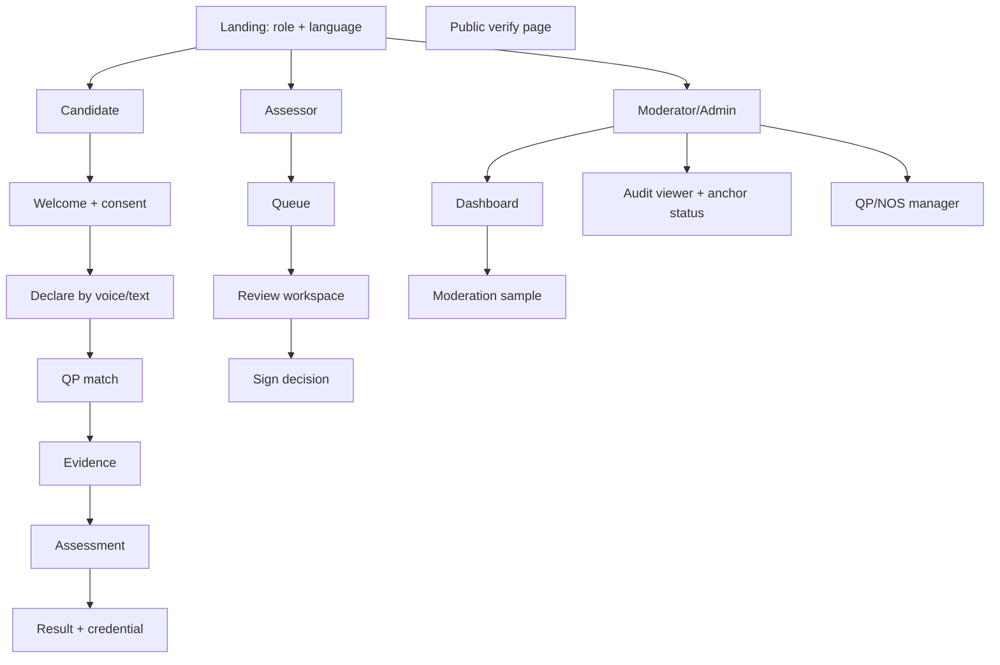
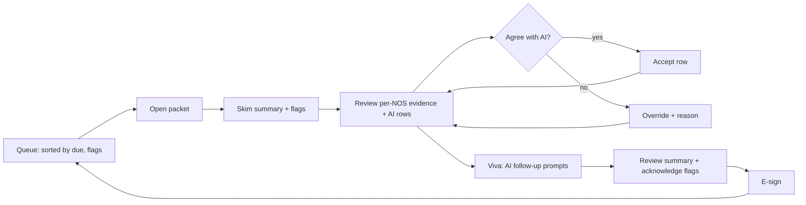

# 12 · UX & Accessibility Design

Scope: candidate, assessor, moderator/admin and verifier experiences. Companion to [03 PRD](03-product-requirements.md) and [11 technical design](11-detailed-technical-design.md). Research-based claims about users are **[Assumption]** until validated in the field research planned in [13](13-implementation-and-testing-plan.md).

## 1. UX principles
| # | Principle | In practice |
|---|---|---|
| 1 | **Voice first, text second** | Every candidate screen can be heard (audio prompt) and, where it makes sense, answered by speaking or tapping pictures |
| 2 | **One thing per screen** | One question, one decision, one big primary button |
| 3 | **Never lose work, always say so** | Persistent status chip: *Saved on phone / Waiting to sync / Synced* |
| 4 | **Show, don't explain** | Icons + photos + short sentences (target grade 4-5 reading level in each language) |
| 5 | **Respect dignity** | Language of recognition ("your experience counts"), never "failed"; use "Not yet" and "next steps" |
| 6 | **AI is visible and humble** | Always labelled "AI suggestion"; confidence shown as words + bar; assessor always final |
| 7 | **Assessor speed with control** | Keyboard/gesture shortcuts, evidence at a glance, undoable actions |
| 8 | **Trust cues, not jargon** | "Verified by assessor <name>, signed <date>"; chain/hash details hidden under "Technical details" |

## 2. Personas recap and context of use
| Persona | Device and setting | Constraints | Design response |
|---|---|---|---|
| Ramesh (candidate) | 2 GB Android, Chrome, sunlight/noise, shared phone possible | Low literacy, regional language, patchy data, limited time | Voice, pictograms, offline, large targets, short sessions with resume |
| Priya (assessor) | Laptop/tablet/phone in field and office | Many candidates, travel, intermittent network | Queue + offline packets, dense review layout, keyboard shortcuts |
| Moderator | Desktop | Sampling and disagreement analysis | Dashboards, drill-down |
| Employer/verifier | Any phone camera | No account, one-time use | QR -> one clear result page, no login |
| Coordinator | Phone/desktop | Batch tracking | Simple batch status board |

## 3. Information architecture

Routes (demo): `#/c/start, #/c/mapping, #/c/evidence, #/c/assess, #/c/result`, `#/a/queue, #/a/review/:id`, `#/m/dashboard, #/m/audit, #/m/qps`, `#/verify/:id` (see `demo/SPEC.md`).

## 4. Journeys

### 4.1 Candidate journey (happy path with emotional curve)
```mermaid
journey
  title Ramesh: from experience to credential
  section Start
    Opens link from SMS / training partner: 3: Ramesh
    Chooses Hindi, hears welcome: 5: Ramesh
    Listens to consent in audio, taps "I agree": 4: Ramesh
  section Declare
    Speaks about 8 years of AC work: 5: Ramesh
    Sees his words, fixes two: 4: Ramesh
    Sees "You match AC Technician" with reasons: 5: Ramesh
  section Evidence
    Photographs a brazed joint, work order: 4: Ramesh
    Employer gets OTP, confirms: 3: Ramesh, Employer
  section Assess
    Phone goes offline in basement - keeps going: 4: Ramesh
    Taps pictures, answers by voice: 4: Ramesh
  section Result
    Assessor signs; sees strengths and 2 gaps: 4: Ramesh
    Gets QR credential on WhatsApp/DigiLocker: 5: Ramesh
```

### 4.2 Candidate stage-by-stage specification
| Stage | Goal | Key UI | Edge cases |
|---|---|---|---|
| Welcome and language | Choose language; build trust | Language tiles with native script + speaker icon; 2-sentence intro audio | Wrong language -> persistent language switcher in header |
| Consent | Informed consent | Plain-language bullets with icons: *what we collect, why, who sees, how long, anchoring fingerprint (optional)*; audio read-out; separate toggles for optional items | Declines optional -> continue; declines mandatory -> kind exit screen |
| Declare | Capture experience | Giant mic button, live waveform, transcript with editable chips; sample-phrase chips if mic denied | Noisy -> "Try again closer to phone"; text fallback; shared phone -> PIN |
| QP match | Confirm role | Cards: occupation title (local name), level badge, "why" with 2-3 matched tasks; "Not me" -> search | Low confidence -> "Assessor will help you pick" |
| Evidence | Show proof | Checklist by skill ("Show a job you did"), camera first, document scan, employer-attest card | Camera denied -> upload; large video -> compress + resume |
| Assessment | Answer | One question; audio auto-play; picture options; progress as dots, not as score; pause anywhere | Offline banner (non-alarming), session timeout -> resume |
| Practical | Do or record a task | Step checklist with icons, record clip, or assessor-led | Unsafe environment -> skip with note |
| Result | Understand outcome | Strengths first, then "next steps" with hours; QR credential; share buttons | Not certified -> bridge plan + "book re-assessment" |
| Appeal | Contest | 2-tap "I disagree", voice note | Shown with status tracker |

### 4.3 Assessor journey

Assessor review layout (desktop, three columns): **left** candidate and NOS navigator with coverage rings; **centre** evidence viewer (photo/video with timestamp markers, doc OCR side-by-side); **right** AI panel for the selected PC (suggested score, rationale, citations as chips linking to NOS text, confidence bar, "Accept" / "Change score"). Sticky footer: progress ("14/22 rows reviewed"), flags count, "Sign" disabled until complete. A permanent banner reads **"AI cannot certify. You decide."**

### 4.4 Moderator/admin journey
Dashboard -> filters (QP, region, assessor, date) -> agreement heatmap (κ per NOS), override rate, score distributions, bias parity charts -> drill into disagreement cases -> record moderation note -> audit viewer with "Verify chain" and "Anchor status" (simulated in demo).

### 4.5 Verifier journey
Scan QR -> single page: big result ("Valid" / "Revoked" / "Not valid"), holder's first name + initials only [Assumption: privacy], QP, NSQF level, issue date, assessor body, three small trust rows (Signature ✓, Not revoked ✓, Witnessed on <date> ✓ or "pending"), "Technical details" accordion (hash, tx, network; labelled *simulated* in demo).

## 5. Wireframe descriptions

(Text wireframes; high-fidelity design in Figma during pilot-ready phase.)

### 5.1 Candidate: Declare screen (360×640 phone)
```
┌─────────────────────────────┐
│ ←   Tell us about your work │  header: back, title, 🔊 (read aloud), EN/हिं
│                             │
│   "Speak freely. We'll      │  helper text, 2 lines max
│    write it down."          │
│                             │
│          ( 🎤 )             │  96px mic button, saffron; pulse while recording
│       ~~~~~~~~~~~~          │  waveform
│   Tap and talk (max 2 min)  │
│                             │
│  ┌ your words ────────────┐ │  transcript card; tap a word to fix
│  │ 8 saal se AC repair…   │ │
│  └────────────────────────┘ │
│  [ Sample: AC repair ] [..] │  sample chips (fallback)
│                             │
│  ● Saved on phone           │  status chip
│  [        Next  →        ]  │  primary button, 56px
└─────────────────────────────┘
```
### 5.2 Candidate: Assessment item
```
┌─────────────────────────────┐
│ ◯◯◯●○○○○     ⏸  🔊 replay   │  progress dots, pause, audio
│  [ photo: gauge reading ]   │
│  "Which gauge shows low     │
│   pressure?"                │
│  ┌──────┐ ┌──────┐          │  big picture/text options, 72px min height
│  │  A   │ │  B   │          │
│  └──────┘ └──────┘          │
│  [ 🎤 Answer by voice ]     │
│  ⚡ Offline - saved          │
└─────────────────────────────┘
```
### 5.3 Candidate: Result
Top: friendly banner "Your experience counts". Middle: per-NOS bars (green Competent, amber "Next step") with icons and one-line plain explanation. Then "Your next steps" card (modules, hours, nearest centre). Bottom: credential card with QR, Share (WhatsApp/DigiLocker), Download PDF, "Ask for review" (appeal).

### 5.4 Assessor: Review (1280px)
As described in §4.3 with keyboard shortcuts: `j/k` next/prev row, `a` accept, `o` override (opens reason with preset reasons + free text), `e` evidence zoom, `v` viva prompts, `?` shortcut help.

### 5.5 Admin: Audit viewer
Table of events (time, actor, action, entity, short hash), "Verify chain" button -> result card (length, head hash, OK/Broken at seq N), "Anchor now" button -> anchor card (root, tx, block, network label "Eklavya-Anchor (simulated; pluggable Polygon/Amoy testnet)"), history of anchors with status chips.

### 5.6 Public verify page
Result banner, trust rows, minimal details, accordion, "Report a problem" link; works on a 2G connection (< 50 KB, server-rendered fallback).

## 6. Low-literacy and voice-first patterns

| Pattern | Detail |
|---|---|
| Audio everywhere | Every screen has "🔊" that reads title, instruction and options; auto-play for first-time screens (can be muted); TTS via on-device voice or pre-recorded clips for critical copy (consent, safety) [Assumption: pre-recorded improves quality in regional languages] |
| Pictorial options | Image-ID items; options as photos of tools/parts; icons with text labels, never icon alone for important actions |
| Voice input | Speak to answer open questions; confirm transcript via read-back; tolerant of code-mixed (Hinglish) |
| Short copy | ≤ 8 words per instruction line; verbs first; avoid abbreviations (spell "QP" as "job role") |
| Numbers | Use numerals with units and pictures; avoid percentages for the candidate view ("3 of 4 skills ready") |
| Large targets | ≥ 48 dp targets, 56 dp primary buttons, ≥ 8 dp spacing |
| Colour not alone | Status uses icon + label + colour |
| Progress | Dots/steps, not "score", to reduce test anxiety |
| Error tone | "Something went wrong on our side. Your work is saved." never blames the user |
| Assisted mode | Coordinator or "digital sakhi" helper can operate the device with candidate present; recorded as `assisted_by` for audit; candidate consent still captured by the candidate |
| Shared devices | Quick PIN per candidate; session lock; clear local data on logout |
| Trust cues | Photos of the assessor, organisation logo, "Free of cost" message **[Assumption: scheme-dependent]** |
| Timing | No hard timers on voice answers; generous pause; resume tokens by SMS |
| Offline wording | "No internet. You can keep going - your answers are saved." |

### Language support
| Phase | Languages | Notes |
|---|---|---|
| Demo | English, Hindi | i18next catalogues, TTS from browser |
| Pilot-ready | + 2 regional (chosen by pilot districts, e.g., Marathi/Tamil/Bengali) **[Assumption]** | Bhashini STT/TTS where available **[Verify coverage]** |
| Scale | Scheduled to cover major Indian languages incl. 22 scheduled **[Verify]** | Community translation review; dialect tests |
Content design: write source copy in plain English, translate by native-speaker reviewers (not machine only), run comprehension tests with 5 users per language before release.

## 7. Accessibility

| Area | Requirement |
|---|---|
| Standard | WCAG 2.1 AA minimum; GIGW 3.0 for government web [Verify current version]; test against WCAG 2.2 AA where feasible |
| Perceivable | Contrast ≥ 4.5:1 (3:1 large text/UI components), captions/transcripts for audio/video prompts, alt text for item images, text resize to 200% without loss |
| Operable | Full keyboard operation (assessor), visible focus ring (2px saffron on teal), no keyboard traps, 48 dp targets, no time limit that cannot be extended |
| Understandable | Plain language, consistent navigation, error prevention + confirmation for irreversible actions (sign decision, revoke) |
| Robust | Semantic HTML, ARIA only where needed, screen-reader tested (TalkBack, NVDA) |
| Motion | Respect `prefers-reduced-motion`; no flashing; animations ≤ 250 ms |
| Colour modes | Light/dark via `prefers-color-scheme`; high-contrast mode |
| Cognitive | One task per screen, undo, resume, recap before submit |
| Hearing/vision/motor | Visual cues for audio, voice control alternatives, switch access via standard Android services |
| Reasonable accommodation | Assessor-led mode for candidates with disabilities; extra time flag recorded and considered in scoring metadata, never auto-penalised **[Verify with RPwD guidance]** |

Acceptance gate: automated (axe, Lighthouse) + manual checklist + usability test with ≥ 5 users with low literacy and ≥ 2 users with disabilities per release candidate.

## 8. Design system summary

**Name:** Eklavya DS. **Direction:** trustworthy, warm, modern; deliberately **non-purple**.

### 8.1 Colour tokens
| Token | Light | Dark | Use |
|---|---|---|---|
| `--ink` | #0B2A2E | #E6F1F0 | Text |
| `--teal-700` (primary) | #0F5C63 | #4FB3B5 | Primary actions, headers |
| `--teal-500` | #1B8A8F | #6CC7C8 | Links, active |
| `--teal-100` | #D7EEEE | #123A3D | Tints |
| `--saffron-500` (accent) | #F29B38 | #F7B25E | CTA highlight, mic button, focus ring |
| `--saffron-100` | #FDEBD0 | #3D2B12 | Accent surface |
| `--surface` | #FAF8F3 | #0E1A1C | Page background (soft off-white) |
| `--card` | #FFFFFF | #142426 | Cards |
| `--success` | #1E8E4E | #4CC38A | Competent, verified |
| `--warning` | #B7791F | #E0A94A | Next step, pending |
| `--danger` | #C0392B | #EF6B5B | Revoked, error |
| `--muted` | #5F7377 | #9DB3B5 | Secondary text |
Values are **proposals [Assumption]**; verify contrast pairs with a checker before freezing (e.g., white on `--teal-700` ≈ 7:1, ink on `--surface` > 12:1 expected).

### 8.2 Typography, spacing, shape, motion
- Typeface: Inter plus Noto Sans for Indic scripts (Devanagari, Tamil, Bengali etc.), system fallback; base 16 px (candidate 18 px), scale 1.2; line height 1.5.
- Spacing: 4 px base grid (4, 8, 12, 16, 24, 32, 48).
- Shape: radius 14-18 px cards, 12 px inputs, pill chips; soft elevation (two levels).
- Icons: Lucide, 24 px stroke 1.75, always with label for key actions.
- Motion: 150-250 ms ease-out; subtle pulse for recording; reduced-motion safe.

### 8.3 Core components
Button (primary, secondary, ghost, danger), Mic button, Status chip (saved/waiting/synced), Offline banner, QP card, NOS progress bar, Evidence tile, Confidence meter, AI suggestion panel (with "AI" badge), Override dialog (reason presets), Signature pad / sign confirmation, Timeline (audit), Credential card with QR, Trust row (check + label), Empty/error states, Toasts (non-blocking).

### 8.4 Semantic labelling conventions
| Concept | Label (EN) | Icon | Colour |
|---|---|---|---|
| AI-generated | "AI suggestion" | sparkles | teal tint |
| Human decision | "Assessor decision" | badge-check | success |
| Needs attention | "Please review" | flag | warning |
| Simulated feature | "Demo - simulated" | beaker | saffron tint |
| Offline | "No internet - saved" | cloud-off | muted |

## 9. Content and microcopy guidelines
Respectful, concrete, brief. Examples:
| Situation | Avoid | Use |
|---|---|---|
| Not yet competent | "You failed Electrical Safety" | "Electrical safety: next step - 6 hours of practice" |
| Low confidence AI | "AI is unsure" | "Your assessor will confirm this match" |
| Offline | "Network error" | "No internet. Your answers are saved." |
| Consent anchoring | "Blockchain hash" | "A secret fingerprint (not your data) is saved so nobody can change your certificate later" |
| Revoked credential | "Invalid" | "This certificate was cancelled on <date>. Contact <body>." |

## 10. Usability research and validation plan
| Method | When | Sample | Success criteria |
|---|---|---|---|
| Contextual inquiry with workers and assessors | Pre-pilot | 8-10 each | Validate journeys, vocabulary |
| Paper/clickable prototype tests | Design | 5 per language | ≥ 80% complete declare step unaided |
| Think-aloud on real low-end phones | Pilot-ready | 10 | Task success ≥ 90%, SUS ≥ 70 [Assumption targets] |
| Comprehension test for consent | Pilot-ready | 5 per language | ≥ 80% correctly explain purpose and withdrawal |
| Field observation of assessors | Pilot | 10 | Review time per candidate ↓ vs baseline |
| Post-use survey (NPS/CSAT in-voice) | Pilot | all | CSAT ≥ 4/5 |
| Accessibility audit | Each release | automated + 3 manual | Zero critical issues |

## 11. Offline UX states
| State | Visual | Behaviour |
|---|---|---|
| Online, synced | green dot, "Synced" | Normal |
| Offline | non-alarming grey banner "No internet - keep going" | All flows allowed |
| Waiting to sync | amber chip with count | Auto-sync on reconnect; manual "Sync now" |
| Sync issue | amber + help link | Item quarantined, support code |
| Airplane-mode toggle (demo) | Switch in header | Simulates offline for demos |
