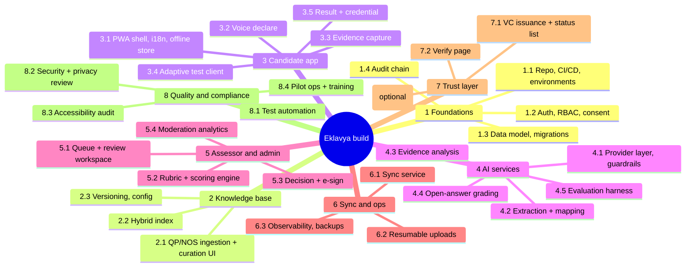

# 13 · Implementation & Testing Plan

Plans and estimates are **[Assumption]** (team size, velocity, calendar) and must be re-baselined after sprint 1. Companion to [08 roadmap](08-demo-plan-roadmap-risks.md) and [11 technical design](11-detailed-technical-design.md).

## 1. Delivery stages
| Stage | Window | Outcome | Exit criteria |
|---|---|---|---|
| S0 Hackathon demo | Days 0-1 (see doc 08, `demo/SPEC.md`) | Vertical slice incl. simulated anchoring | Scripted demo runs offline and online |
| S1 Pilot-ready build | Months 0-3 | Hardened platform, 10-15 QPs, 3 languages | Security review passed, golden-set targets met on dev set, UAT signed |
| S2 Pilot | Months 3-6 | 2 districts, ~1,000 candidates | Pilot protocol (§9) metrics evaluated |
| S3 Integration | Months 6-12 | SIDH/DigiLocker/NQR/Bhashini, SSC credential issuance, optional anchor | Integration tests with sandbox endpoints |
| S4 Scale | Months 12-24 | 100+ QPs, kiosks, on-prem models | SLOs sustained for 3 months |

## 2. Work breakdown structure (WBS)

### WBS detail with effort (person-weeks, ±40%) [Estimate]
| ID | Work package | Depends on | Effort |
|---|---|---|---|
| 1.1 | Repo, CI/CD, IaC, environments | - | 3 |
| 1.2 | Auth/OIDC/OTP, RBAC, consent ledger | 1.1 | 5 |
| 1.3 | Schema, migrations, seeds | 1.1 | 3 |
| 1.4 | Audit hash chain + verifier | 1.3 | 2 |
| 2.1 | QP/NOS ingestion + curator UI | 1.3 | 6 |
| 2.2 | Hybrid index + embeddings | 2.1 | 3 |
| 3.1 | PWA shell, i18n, encrypted local store | 1.1 | 5 |
| 3.2 | Voice declare + transcript editor | 3.1, 4.1 | 3 |
| 3.3 | Evidence capture, hash, compress | 3.1 | 4 |
| 3.4 | Client adaptive selector | 3.1, 5.2 | 4 |
| 3.5 | Result + credential screens | 7.1 | 3 |
| 4.1 | AI provider layer + guardrails | 1.1 | 4 |
| 4.2 | Extraction + RAG mapping | 2.2, 4.1 | 6 |
| 4.3 | Evidence analysis (OCR/VLM/integrity) | 3.3, 4.1 | 7 |
| 4.4 | Open-answer grading | 4.1, item bank | 3 |
| 4.5 | Evaluation harness + golden sets | 4.2 | 5 |
| 5.1 | Assessor queue + review workspace | 1.2 | 8 |
| 5.2 | Scoring engine + item bank service | 1.3 | 6 |
| 5.3 | Decision + e-sign + appeals | 5.1, 1.4 | 4 |
| 5.4 | Moderation analytics (κ/ICC) | 5.3 | 4 |
| 6.1 | Sync service + conflict handling | 1.3 | 6 |
| 6.2 | tus uploads + media pipeline | 1.1 | 3 |
| 6.3 | Observability, backup/DR | 1.1 | 3 |
| 7.1 | VC issuance, status list, KMS signing | 5.3 | 5 |
| 7.2 | Public verify page | 7.1 | 2 |
| 7.3 | Anchor module (Merkle, adapter, monitor) | 1.4, 7.1 | 5 |
| 8.1 | Test automation across modules | all | 8 |
| 8.2 | Security + privacy (DPIA) | all | 5 |
| 8.3 | Accessibility audit and fixes | 3.x, 5.x | 3 |
| 8.4 | Pilot ops, training, content (items, translations) | - | 12 |
**Total ≈ 140 person-weeks**, i.e., roughly 6 engineers + 1 designer + 1 data/content lead + 1 QA over ~4 months [Assumption].

## 3. Sprint plan (S1 pilot-ready; 2-week sprints)

| Sprint | Theme | Key deliverables | Demo-able |
|---|---|---|---|
| 1 | Foundations | CI/CD, envs, auth skeleton, schema, audit chain, design tokens | Login, audit verify |
| 2 | Knowledge base | QP/NOS ingest for first 5 QPs, curator UI, hybrid index | Search NOS by Hindi/English phrase |
| 3 | Candidate core | PWA shell, i18n, encrypted local store, consent, voice declare | Offline declare |
| 4 | Mapping + evidence | Extraction, mapping with citations, evidence capture, tus uploads | QP suggestions with citations |
| 5 | Assessment engine | Item bank service, server + client selector, scoring v1 | Adaptive test offline |
| 6 | Assessor workspace | Queue, review packet, rubric accept/override, viva suggestions | Review flow |
| 7 | Decision + credential | E-sign, decision guard, VC issuance, status list, verify page | End-to-end certificate |
| 8 | Sync hardening | Conflict rules, quarantine, field mode for assessors, evidence analysis v1 | Airplane-mode e2e |
| 9 | Analytics + anchoring | κ/ICC dashboards, drift, simulated -> adapter anchor, optional Amoy PoC | Moderation dashboard |
| 10 | Quality | Performance tuning, accessibility fixes, red-team, pen-test fixes | Test reports |
| 11 | Content + UAT | 10-15 QP item banks SME-reviewed, 3 languages, UAT with SSC/assessors | UAT sign-off |
| 12 | Release + pilot prep | Runbooks, training, DPIA closure, go/no-go | Pilot readiness review |

Definition of Ready: user story with acceptance criteria, design, test data, dependencies. Definition of Done: code reviewed, unit/integration tests, accessibility check, security checks green, docs updated, feature flag defined, demo-able.

## 4. Test strategy

### 4.1 Test pyramid and scope
| Level | Tools [Assumption] | Scope | Target |
|---|---|---|---|
| Unit | pytest, Vitest | Scoring, selector, merge, hash chain, Merkle, κ | ≥ 85% line coverage on core logic; 100% on scoring/decision guard |
| Property-based | Hypothesis / fast-check | Idempotency, merge commutativity, Merkle proofs, selector invariants | Key invariants (§4.2) |
| Contract | OpenAPI + Schemathesis/Pact | API vs clients | No breaking changes |
| Integration | Testcontainers (Postgres, MinIO, Redis) | Services + DB + queue | All critical paths |
| End-to-end | Playwright (with network throttling/offline) | Candidate/assessor journeys | Smoke on every PR; full nightly |
| Offline/Sync | Playwright + service worker + chaos proxy | Airplane, packet loss, kill-tab, resume | 99.5% sync success in test matrix |
| AI evaluation | Custom harness (§5) | Extraction, mapping, grading, evidence | Targets in §5.4 |
| Performance | k6, Lighthouse | API p95, 3G first load | Budgets from doc 11 §8 |
| Security | SAST (Semgrep), DAST (ZAP), dependency scan, secret scan, pen-test | OWASP ASVS L2 | No high/critical open |
| Privacy | DPIA, data-flow tests (no PII to logs/LLM/chain) | DPDP controls | Zero PII in anchor payloads (automated check) |
| Accessibility | axe, Lighthouse, manual (TalkBack, NVDA) | WCAG 2.1 AA | Zero critical |
| Usability | Moderated tests | See doc 12 §10 | SUS ≥ 70 |
| Disaster recovery | Game days | Backup restore, region failover | RPO ≤ 15 min, RTO ≤ 4 h [Assumption] |

### 4.2 Critical invariants as automated tests
| ID | Invariant | Test |
|---|---|---|
| INV-1 | **No AI actor can create a Decision** | DB role grants test; API fuzz with AI service token -> 403; CHECK constraint test |
| INV-2 | Decision requires all critical PCs scored and flags acknowledged | Integration tests |
| INV-3 | Sync is exactly-once in effect | Replay same batch N times -> identical state |
| INV-4 | Selector parity client/server | Shared vectors (seed + responses -> item ids) |
| INV-5 | Audit chain tamper detection | Mutate any row -> verify fails at that seq |
| INV-6 | Merkle proof soundness | Property test: all leaves verify; any tamper fails |
| INV-7 | No PII on-chain / in anchor | Schema allow-list + regex scan of payloads |
| INV-8 | Uncited AI claim never displayed | Mutation test on LLM stub returning bad ids |
| INV-9 | Critical PC failure => NOS not Competent | Scoring table tests |
| INV-10 | Revoked credential never verifies as valid | Verify API tests incl. stale-cache behaviour |
| INV-11 | Consent withdrawal stops processing and triggers erasure | End-to-end + job test |
| INV-12 | Offline decision cannot be applied if packet changed | Hash-binding test |

### 4.3 Test data
Synthetic candidates (Hindi/English/regional transcripts, noise-augmented audio), curated evidence images, forged-document samples, adversarial transcripts; no real PII in non-production environments.

### 4.4 Defect and release gates
Severity S1 (security/integrity/AI-invariant): release blocker. S2: fix before pilot. Release requires green CI, golden-set no-regression, zero open S1, signed risk review.

## 5. AI evaluation plan

### 5.1 Principles
Evaluate each AI function against expert-labelled data; report with confidence intervals and slice metrics (language, gender where lawfully/consentedly collected, region, QP, audio quality); pre-register thresholds; freeze test set; separate dev/test; re-run on every model/prompt change.

### 5.2 Golden sets
| Set | Contents | Size (target) | Labelling |
|---|---|---|---|
| G1 Mapping | Experience narratives (spoken + typed, multiple languages, code-mixed) -> correct QP(s) and NOS | 300 narratives, 3-4 QPs in demo; 100+ QPs eventually | 2 SSC SMEs independently + adjudication (κ reported) |
| G2 Extraction | Transcripts -> task/tool/material spans | 200 | Annotators with guidelines |
| G3 Open-answer grading | Answers with reference keypoints | 600 answers (50/NOS sample) | 2 SMEs |
| G4 Evidence tagging | Photos/docs -> PC tags | 500 images | SME |
| G5 Rubric pre-score | Practical videos with assessor scores | 100 videos | 3 assessors (agreement measured) |
| G6 Integrity | Forged/duplicate/recaptured media; fake letters | 150 | Constructed + audited |
| G7 Safety/robustness | Prompt injection, offensive content, PII baiting, out-of-scope claims | 100 prompts | Red team |
| G8 Speech | Audio with ground truth transcripts across dialects/noise | 20 h | Transcribers; WER |
| G9 Fairness | Matched narratives differing only by language/dialect/gender cue | 200 pairs | Constructed |

### 5.3 Metrics
| Function | Metrics |
|---|---|
| STT | WER/CER by language and noise bucket |
| Extraction | Span/slot F1, hallucinated-field rate |
| Mapping | Top-1/top-3 accuracy, MRR, NDCG; **citation validity (must be 100%)**; calibration (ECE, reliability curve); abstention precision |
| Open-answer grading | Quadratic weighted κ vs SME; MAE on keypoint coverage; false-credit rate |
| Evidence tagging | Precision/recall per PC; flag precision (false alarms burden) |
| Rubric pre-score | Weighted κ vs assessors; assessor acceptance rate; time saved |
| Adaptive engine | Test-length vs measurement SE; reliability (simulated, then real); exposure rates; DIF flags |
| Integrity checks | Detection rate at fixed false-positive rate |
| Robustness | Injection success rate (target 0), schema-validity rate |
| Fairness | Metric gaps across slices (e.g., top-3 accuracy gap, grading bias, override-rate gap); alert threshold: gap > 5 pp or CI excludes 0 [Assumption] |
| Cost/latency | ₹/candidate, p95 latency |

### 5.4 Acceptance targets (pilot-ready) [Assumption; align with doc 08]
Top-3 QP mapping ≥ 85%; citation validity 100%; extraction F1 ≥ 0.85; open-answer weighted κ ≥ 0.7 vs SME; rubric suggestion acceptance ≥ 70% with κ ≥ 0.6 vs assessors; injection success 0%; fairness gap ≤ 5 pp; AI-only certifications 0.

### 5.5 Online monitoring and human feedback
Assessor accept/override signals captured with reasons; weekly review of top disagreement clusters; drift alerts (input distribution, score distribution); no automatic retraining on candidate data without governance approval and consent (doc 07 §4). Change control: model/prompt change -> run G1-G9 -> compare to baseline -> review board sign-off -> staged rollout (10% -> 50% -> 100%) -> rollback plan.

### 5.6 Item-bank quality and psychometrics
Item review checklist (clarity, single key, NOS alignment, language, cultural neutrality). After ≥ 200 responses/item: p-value, point-biserial, IRT calibration (2PL), distractor analysis, **DIF analysis** (Mantel-Haenszel across language/gender/region) with SME re-review for flagged items. Retire items with poor discrimination or exposure above threshold. Reliability target (Cronbach's α or marginal reliability) ≥ 0.8 per NOS-test [Assumption].

### 5.7 Validity argument
Content validity (NOS-derived), criterion validity (agreement with traditional RPL assessment outcomes on a subset), consequential validity (appeals, post-certification employer feedback). Pilot includes a **parallel-run subset**: same candidates assessed through conventional process and Eklavya-assisted process, blind where feasible.

## 6. Red-team and safety testing
Prompt injection through transcript/OCR/evidence text; jailbreak to emit pass/fail; PII extraction attempts; biased outputs; evidence forgery (edited photos, recycled invoices); assessor-collusion simulations; adversarial offline tampering (modify IndexedDB, replay mutations, spoof time). Findings tracked as S1/S2 defects.

## 7. CI/CD

- Branching: trunk-based, short-lived branches, required reviews (2 for decision/credential/scoring modules), signed commits [Assumption].
- Pipelines: GitHub Actions (or Gitea/GitLab for government environments) [Assumption]; reproducible builds; SBOM; image signing; policy checks (OPA).
- Database migrations: expand/contract, tested on production-like data; never destructive in the same release.
- Feature flags for anchoring, AI provider, languages.
- Environments: dev, staging (prod-like, synthetic data), pilot-prod, DR.

## 8. DevOps and operations
| Area | Plan |
|---|---|
| Infra as code | Terraform/Ansible; Docker Compose for demo -> Kubernetes (India region cloud or MeghRaj/NIC [Verify availability]) |
| Observability | OpenTelemetry traces, Prometheus metrics, Grafana dashboards, Loki logs, Sentry; **AI quality dashboard** (schema-valid %, citation-valid %, latency, cost, override rate) |
| SLOs | API availability 99.5% (pilot), p95 < 500 ms non-AI, sync success ≥ 99.5%, AI mapping p95 < 8 s |
| Alerts | Error budget burn, citation-failure > 0, audit-chain verify failure, anchor reconciler mismatch, queue depth, storage quota |
| Backups/DR | PITR for Postgres, object-store versioning, quarterly restore drill; RPO ≤ 15 min, RTO ≤ 4 h [Assumption] |
| Secrets/keys | Vault/KMS, HSM for issuer key, rotation schedule, break-glass procedure |
| Security ops | Quarterly pen-test, dependency updates weekly, vulnerability SLA (critical 7 days) |
| Incident management | Severity matrix, on-call, runbooks, blameless post-mortems, DPDP breach notification playbook |
| Cost ops (FinOps) | Per-candidate AI cost dashboard; budgets/alerts; model tiering |
| Kiosk/edge | Pre-baked image; signed updates; remote health reporting when online |
| Support | Helpline (voice) for candidates; assessor chat; in-app support code |

## 9. Pilot protocol

### 9.1 Objectives and hypotheses
H1 time-to-certify reduces ≥ 50%; H2 assessor throughput ≥ 2×; H3 inter-assessor agreement κ ≥ 0.75; H4 candidate completion ≥ 90%; H5 offline sync ≥ 99%; H6 AI suggestions accepted ≥ 70% with no AI-only decisions. (Targets from doc 08; baseline from the conventional process is **to be measured [Verify]**.)

### 9.2 Design
| Element | Plan |
|---|---|
| Sites | 2 districts (one peri-urban, one rural), 2-3 sectors/QPs, with SSC/training-partner agreement [Verify] |
| Participants | ~1,000 candidates, ~15-20 assessors, 3-4 moderators [Assumption] |
| Design | Mixed methods; phased cohorts (A: Eklavya-assisted; B: conventional) with parallel-run subset of ~150 for validity (§5.7); quasi-experimental, not randomised (ethics, scheme rules) |
| Duration | 12-16 weeks incl. 2 weeks training and 2 weeks of analysis |
| Ethics and governance | Informed consent, institutional review/ethics advice [Verify], DPDP compliance, grievance channel, right to opt for conventional route |
| Safeguards | Human decision for 100% of outcomes; stop rules (§9.5); no adverse consequence if candidate declines |

### 9.3 Data collection
System logs (timestamps for each step), assessor time tracking (sampled), surveys (candidate CSAT/NPS, assessor SUS), moderation double-marking (10-20%), appeal records, AI acceptance/override data, offline/sync telemetry, cost data.

### 9.4 Metrics and analysis
Primary: time-to-certify; assessor throughput; κ/ICC; completion rate. Secondary: mapping accuracy, appeal rate/outcomes, fairness gaps, sync success, cost per candidate, employer verification usage. Analysis: pre-specified plan; CIs; slice analyses; qualitative coding of interviews.

### 9.5 Stop/rollback rules [Assumption]
Stop or pause if: any AI-only decision found; data breach; fairness gap > 10 pp unresolved after review; sync data-loss incident; assessor workload increases > 20% with no gain after 4 weeks.

### 9.6 Rollout checklist
Training (assessors 1 day, coordinators half day, candidates 15-min guided onboarding), device audit, connectivity plan, kiosk setup, helpline roster, escalation matrix, data protection notices, consent forms, appeal procedure, comms in local languages.

### 9.7 Risks specific to the pilot
Low smartphone ownership, shared phones, assessor resistance, SSC approval timelines, seasonal migration of workers. Mitigations: assisted mode, kiosks, assessor incentives/time-savings messaging, early SSC engagement, flexible scheduling.

## 10. RACI (summary)
| Activity | Product | Eng | AI/Data | Design | SSC/SME | QA | Compliance |
|---|---|---|---|---|---|---|---|
| Requirements | A | C | C | C | R | I | C |
| Item banks | I | I | C | I | **R/A** | C | I |
| AI evaluation | C | C | **R/A** | I | R | C | I |
| Release | A | R | C | I | I | R | C |
| DPIA | C | C | C | I | I | I | **R/A** |
| Pilot ops | **A** | C | C | C | R | C | C |

## 11. Definition of "demo-ready" for the hackathon (subset)
Seeded data and deterministic engine, working offline toggle, assessor override and decision guard (INV-1/2 tests), credential verify including **simulated** anchor with visible label, audit verify, backup video. Do not touch demo/ in this documentation task; see `demo/SPEC.md`.
