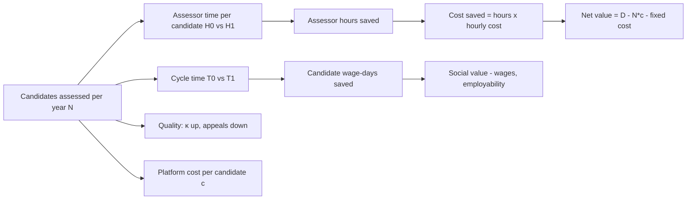

# 14 · Business Impact & Sustainability

> **Reading guide.** Public facts are cited with links. Every number in an *impact model* is an **[Assumption]** (a parameter you can change) or **[Estimate]**, not a measured result. The model is meant to show *how* value is computed and what must be measured in the pilot (doc 13 §9), not to promise outcomes. Items to confirm with MSDE/NSDC/SSC are marked **[Verify]**.

## 1. Context and market need

| Fact | Source / status |
|---|---|
| A large majority of India's workforce is informal; informality measures approach ~90% depending on definition, and in 2025 about 73% of non-agricultural workers were in proprietary/partnership (informal-sector) enterprises per PLFS | [SBI Research on PLFS](https://sbi.bank.in/documents/13958/14472/08052026_PLFS_SBI+RESEARCH.pdf/e97cfeb9-95fb-cf06-19f3-029ac971fd5e?t=1778220646800), [WIEGO profile](https://www.wiego.org/research-library-publications/informal-workers-india-statistical-profile/) **[Verify latest figures]** |
| RPL is a component of PMKVY; secondary sources report on the order of tens of lakhs RPL-certified to date (e.g., ~47 lakh) | [PMKVY RPL pages](https://rplpmkvy3.nsdcindia.org/Index.html), [PIB Skill India RPL](https://static.pib.gov.in/WriteReadData/specificdocs/documents/2022/apr/doc202242548301.pdf) **[Verify counts and date]** |
| NSQF: levels 1-10; RPL assessed against the same approved QPs | [NCVET](https://ncvet.gov.in/), [NCVET RPL guidelines](https://ncvet.gov.in/wp-content/uploads/2023/08/Final-RPL-guidelines.pdf) |
| NEP 2020 aims for exposure to vocational education for at least 50% of learners by 2025 and integration of skills with mainstream education | [Review of NEP 2020 to 2025](https://educationforallinindia.com/review-of-nep-2020-to-2025-with-focus-on-vocationalisation-of-education/) **[Verify against policy text]** |
| PMKVY 4.0 guidelines (MSDE) cover RPL provisions | [PMKVY 4.0 Guidelines](https://www.msde.gov.in/static/uploads/2024/02/PMKVY-4.0-Guidelines_final-copy.pdf) **[Verify RPL clauses and unit costs]** |

**Gap Eklavya addresses:** the bottleneck is not demand for recognition, it is the *cost, time and consistency of assessment* (doc 01 pain points 1-9). The opportunity is to raise assessor productivity and quality, not to replace the assessor.

## 2. Stakeholder value map

| Stakeholder | Pain today | Eklavya value | How measured (pilot) |
|---|---|---|---|
| Candidate (worker) | Lost wages for assessment days, language/literacy barriers, no documented experience, no next step | Assess when/where convenient (offline), in own language, evidence captured once, clear gap -> bridge plan, portable verifiable credential | Completion rate, time-to-certify, CSAT, days of wages lost [Assumption: survey] |
| Assessor | Heavy paperwork, travel, repeated rubric entry, isolation | Prepared review packet, AI pre-fill (editable), fewer clerical steps, calibration feedback | Candidates/assessor/week, review minutes per candidate, acceptance rate |
| Training partner / coordinator | Batch scheduling, drop-offs | Status board, shorter cycles, bridge-course allocation | Batch cycle time, drop-off % |
| Assessment body / moderator | Cannot see consistency | κ/ICC dashboards, drift & anomaly flags, audit trail | κ, override rates, flagged cases resolved |
| SSC | Quality assurance, QP/NOS updates | QP/NOS KB with versioning, analytics by QP, fewer disputes | Dispute/appeal rate, QP coverage |
| NSDC / MSDE / NCVET | Scale vs quality, fraud risk, reporting | Auditable, standardised process; dashboards; tamper-evident records (optional anchor) | Cost per certified candidate, audit findings |
| Employers | Cannot trust paper certificates, slow verification | 10-second QR verification with revocation status, attested experience | Verification usage, employer trust score [survey] |
| Government / society | Informal workers excluded from formal recognition | Formalisation pathway, better skill data | Number of newly recognised workers, wage/placement outcomes [long-term] |
| Training/bridge providers | Unclear demand | Gap-driven referrals | Referral conversion |

## 3. Impact model

### 3.1 Structure

### 3.2 Assumptions (all adjustable; replace with pilot data)
| ID | Parameter | Baseline (conventional) | With Eklavya | Basis |
|---|---|---|---|---|
| A1 | Assessor effort per candidate (hours, incl. paperwork, review, viva) | H0 = 3.0 | H1 = 1.5 (-50%) | **[Assumption]** aligns with target "assessor capacity ≥ 2×" (doc 08) |
| A2 | Assessor fully-loaded cost per hour | ₹250 | ₹250 | **[Assumption]**; replace with assessment-body rates |
| A3 | Time from registration to certificate (days) | T0 = 30 | T1 = 15 (-50%) | **[Assumption]**, target in doc 08 |
| A4 | Candidate days of lost wages per assessment | 1.0 | 0.5 | **[Assumption]** (offline, flexible slots) |
| A5 | Daily wage proxy | ₹500 | ₹500 | **[Assumption]**; varies by trade/region |
| A6 | Platform variable cost per candidate: AI ₹12, hosting/storage ₹15, SMS/OTP/voice ₹8, support ₹25 | - | c = ₹60 | AI cost target from doc 04 [Estimate]; others [Assumption] |
| A7 | Fixed annual cost (core team, security audits, content/SME upkeep, compliance) | - | F = ₹2.5 crore at pilot-to-early-scale | **[Assumption]** |
| A8 | Candidate drop-off before completion | 35% | 10% | **[Assumption]**; target completion ≥ 90% |
| A9 | Appeal/dispute rate | 5% | 3% | **[Assumption]** |

### 3.3 Computation (illustrative)
Per-candidate gross assessor saving = (H0 − H1) × A2 = 1.5 × 250 = **₹375**.
Per-candidate net operating saving = 375 − c = 375 − 60 = **₹315**.
Candidate-side value per candidate = (A4 baseline − with) × A5 = 0.5 × 500 = **₹250** wage-days preserved (social value, not budget saving).

| Scale (candidates / year) | Gross assessor saving | Platform variable cost | Net operating saving | After fixed cost F=₹2.5 cr | Candidate wage preserved |
|---|---|---|---|---|---|
| 10,000 | ₹37.5 lakh | ₹6 lakh | ₹31.5 lakh | −₹2.19 cr (investment phase) | ₹25 lakh |
| 100,000 | ₹3.75 cr | ₹0.6 cr | ₹3.15 cr | +₹0.65 cr | ₹2.5 cr |
| 1,000,000 | ₹37.5 cr | ₹6 cr | ₹31.5 cr | +₹29 cr | ₹25 cr |
(1 crore = 10 million; 1 lakh = 100,000.)

**Break-even volume** = F ÷ (net saving per candidate) = ₹2.5 cr ÷ ₹315 ≈ **79,400 candidates/year** under these assumptions. Sensitivity: if H1 is only 2.0 h (−33%), net saving per candidate = 125 − 60 = ₹65, break-even ≈ 3.8 lakh candidates/year; if AI/support cost doubles (c = ₹120), break-even ≈ 98,000. The model therefore says: **value depends mainly on actual assessor-time reduction and volume**, which is exactly what the pilot must measure.

### 3.4 Non-financial and quality outcomes (to be measured)
| Outcome | Metric | Target [Assumption] |
|---|---|---|
| Faster recognition | Median days to certificate | −50% |
| Fairer, consistent assessment | Weighted κ/ICC; override-rate dispersion across assessors | κ ≥ 0.75 |
| Inclusion | Completion rate for low-literacy / women / rural candidates; parity gaps | ≥ 90% completion; gap ≤ 5 pp |
| Trust | Employer verification usage; credential disputes; fraud flags resolved | Rising use; disputes ↓ |
| Pathway | % of "bridge required" who enrol and re-assess within 90 days | ≥ 40% |
| Safety of automation | AI-only certifications | 0 |

### 3.5 What we will *not* claim
No claims about wage increases, placement rates or macro GDP effects without pilot evidence. Any such figures in the deck must be labelled as projections with assumptions.

## 4. Adoption strategy

### 4.1 Principles
1. **Fit into the existing system:** same QPs/NOS, same SSC and assessor accreditation, same certificate authority. Eklavya is a better workflow, not a new regime.
2. **Assessor-first adoption:** assessors who save time are the strongest champions; keep override always available.
3. **Prove with the pilot, then scale by endorsement:** SSC and NSDC endorsement are the gating factors, not marketing.
4. **Lowest-friction distribution:** SMS/WhatsApp links, kiosks at training centres, coordinator-assisted mode.

### 4.2 Phased go-to-market (aligned with doc 08 roadmap)
| Phase | Segment | Action | Success signal |
|---|---|---|---|
| Hackathon | Evaluators | Working demo, documentation | Selection / feedback |
| Pilot-ready | 1-2 SSCs, 1 assessment body | MoU for QP/NOS data and pilot access [Verify] | 10-15 QPs loaded |
| Pilot | 2 districts, ~1,000 candidates | Training, field support, parallel run | Pilot metrics (doc 13 §9) |
| Integration | NSDC/Skill India Digital, DigiLocker | API integrations; SSC credential issuance | Production data flows |
| Scale | State skill missions, large employers, PSU/CSR programmes, ITI/polytechnic RPL, construction/health/retail/electronics clusters | Procurement via government channels; reference deployments | Sustained volume |

### 4.3 Barriers and responses
| Barrier | Response |
|---|---|
| "AI will replace assessors" | Positioning and enforcement: AI cannot certify; assessors gain throughput; accreditation unchanged |
| Data/QP access | Public NSQF/NQR documents first; MoU later |
| Regulatory acceptance of digital/remote evidence | Pilot evidence, parallel-run validity study, SSC sign-off per QP |
| Digital divide | Assisted mode, kiosks, voice-first, offline |
| Trust in credential | Signed VC + optional witness anchor + public verify page |
| Procurement cycles | Open-source core, modular licensing, pilot-as-a-service |
| Language coverage | Bhashini integration, community reviewers |

## 5. Business and cost model

### 5.1 Who pays (options, to be chosen with MSDE/NSDC) [Assumption]
| Model | Payer | Notes |
|---|---|---|
| A. Government-funded platform | MSDE / NSDC / state skill mission | Aligns with scheme-funded RPL; per-candidate or per-annum licence |
| B. Assessment-body SaaS | Assessment bodies / training partners | Per-assessed-candidate fee within existing scheme payments |
| C. Employer-sponsored | Large employers/CSR | Bulk RPL for workforce formalisation (e.g., contractors) |
| D. Open-source core + paid support | Public good + services | Reduces lock-in concerns, enables sovereign deployment |
Candidates **never pay** to be assessed in scheme-funded flows [Assumption; scheme-dependent].

### 5.2 Cost model (annual; ₹ crore; illustrative)
| Cost line | Pilot (1k candidates) | Early scale (100k) | Scale (1M) | Basis |
|---|---|---|---|---|
| Team (product, eng, AI, design, QA) | 1.8 | 2.4 | 4.0 | [Assumption] ~12-25 FTE blended |
| Content (QP/NOS curation, SME item review, translations) | 0.4 | 0.6 | 1.2 | [Assumption] |
| Infra (cloud, storage, observability) | 0.1 | 0.5 | 3.0 | scale with media storage |
| AI inference | 0.0 | 0.12 | 1.2 | ₹12/candidate [Estimate] |
| Support/helpline | 0.1 | 0.25 | 2.5 | ₹25/candidate at scale [Assumption] |
| Security/compliance (pen-tests, audits, DPIA) | 0.3 | 0.4 | 0.8 | [Assumption] |
| Optional anchoring | 0.0 | 0.03 | 0.08 | permissioned nodes, doc 10 §8 [Assumption] |
| **Total** | **~2.7** | **~4.3** | **~12.8** | |
| Cost per candidate | ~₹27,000 (pilot, not representative) | ~₹4,300 | ~₹1,280 | |
Note: these totals exceed the per-candidate marginal cost used in §3 because fixed cost dominates at low volume; the economics only work at volume, as the break-even analysis shows. The §3 table simplified fixed cost to ₹2.5 cr; use this table when reconciling with a real budget **[Assumption: reconcile before sharing externally]**.

### 5.3 Unit-economics levers
Shift routine tasks to small/cached models; ship-with-open-source models for on-prem; compress media; re-use item banks across QPs; assessor-productivity gains; shared kiosks; volume discounts on SMS; avoid on-chain per-credential costs (batch anchors, doc 10).

### 5.4 Sustainability beyond grant/hackathon
- **Technical:** open standards (W3C VC, OpenAPI, Postgres), modular adapters, documented runbooks, no vendor lock-in for AI or ledger.
- **Financial:** per-candidate service fee or annual platform licence via scheme budgets; employer-funded programmes; optional paid analytics for SSCs.
- **Institutional:** governance board (MSDE/NSDC/SSC/assessor reps/civil society), QP content stewardship by SSCs, change-control of AI via review board (doc 07 §4).
- **Community:** open-source core, contributor guide, translation community, assessor feedback loop.
- **Environmental:** low-power PWA, shared kiosks, avoiding energy-heavy chain designs (anchoring uses batched roots; a permissioned chain or testnet has minimal footprint).

## 6. Scaling plan

| Dimension | Stage 1 (pilot) | Stage 2 (state) | Stage 3 (national) |
|---|---|---|---|
| Candidates / year | 1k | 100k | 1M+ |
| QPs | 10-15 | 50 | 100+ (prioritised by demand) |
| Languages | 3 | 8 | 15-22 [Verify] |
| Deployment | Single region cloud | Multi-AZ + regional kiosks | Multi-region India, edge kiosks, on-prem for sensitive tenants |
| AI | Hosted API, tiered | Mixed hosted + self-hosted | Primarily self-hosted/sovereign for routine tasks |
| Data | One DB | Read replicas, partitioning by tenant/state | Sharded by state/SSC, object-store lifecycle |
| Ops | Small SRE | 24x7 on-call | SRE + regional support |
| Governance | Pilot steering | State skill mission board | National advisory board |
Scaling risks: assessor supply (train-the-trainer), QP update churn, item-bank quality at 100+ QPs (psychometric ops), AI cost drift, helpdesk load, data-residency. Mitigations are in docs 11-13.

**Technical scale levers:** stateless API autoscaling, async AI queue, media on object storage with lifecycle, per-tenant partitions, caching of retrieval, anchor batching, CDN for static/PWA assets.

## 7. Policy alignment

| Policy / framework | Alignment | Notes |
|---|---|---|
| **NSQF** (levels 1-10; QPs/NOS; NCVET) | Every question, rubric row and score maps to a NOS/PC; level recommendation by QP; outputs NSQF-level profile | Authoritative standards via NQR/SSC [Verify ingestion rights] |
| **RPL guidelines (NCVET / PMKVY RPL)** | Documentary evidence + theory/viva + practical; core/non-core weighting; bridge training; assessor-led certification | [NCVET RPL guidelines](https://ncvet.gov.in/wp-content/uploads/2023/08/Final-RPL-guidelines.pdf); thresholds per SSC [Verify] |
| **Skill India Mission / PMKVY 4.0** | Supports RPL scale-up, integrates with SIDH/SDMS (proposed) | [PMKVY 4.0 Guidelines](https://www.msde.gov.in/static/uploads/2024/02/PMKVY-4.0-Guidelines_final-copy.pdf) [Verify] |
| **NEP 2020** | Skills + equivalence/pathways between vocational and general education, recognition of non-formal learning; credit-framework linkage (NCrF) | [NEP review](https://educationforallinindia.com/review-of-nep-2020-to-2025-with-focus-on-vocationalisation-of-education/) [Verify NCrF linkages] |
| **DPDP Act 2023 / Rules 2025** | Consent, minimisation, residency, erasure, grievance | Doc 07 §3, doc 10 §3.4 [Verify] |
| **Digital India / DigiLocker / India Stack** | Credential in DigiLocker, consented identity, Bhashini languages | Proposed integrations |
| **Accessibility (RPwD Act, GIGW, WCAG)** | Doc 12 §7 | [Verify GIGW version] |
| **Responsible AI (NITI Aayog principles; MeitY guidance)** | Human final authority, transparency, contestability, bias monitoring | Doc 05, doc 07 §4 [Verify current guidance] |
| **ILO/UNESCO RPL good practice** | Evidence triangulation, moderation, appeals | [ILO RPL India](https://www.ilo.org/media/446091/download) |

## 8. Risks to impact and sustainability
| Risk | Likelihood | Impact | Mitigation |
|---|---|---|---|
| Assessor-time savings smaller than assumed | Medium | High | Pilot-measure H1; UX iteration; scope AI pre-fill to high-yield tasks |
| Slow SSC/NSDC approvals | High | High | Early engagement; parallel-run evidence; configurable per-QP policies |
| AI cost drift | Medium | Medium | Tiering, caching, self-hosted models |
| Fairness issues in STT/LLM | Medium | High | Slice monitoring, human oversight, assessor oral fallback |
| Funding gap after pilot | Medium | High | Multiple payer models (§5.1), open-source core |
| Perception that chain = trust | Low | Medium | Honest labelling (doc 10 T11) |
| Data breach | Low | Very high | Doc 07 controls, minimal retention, pen-tests |

## 9. KPIs dashboard (for sponsors)
Candidates registered/assessed/certified; median days to certify; assessor capacity; κ; completion/drop-off; appeal rate; fairness parity gaps; AI-only certifications (must be 0); sync success; cost per certified candidate; employer verifications; bridge enrolment/re-assessment pass; CSAT/NPS.

## 10. Summary of claims and their evidence status
| Claim | Status |
|---|---|
| Informal workforce is large | Cited, [Verify latest] |
| Eklavya cuts assessor effort ~50% | **Target, unproven until pilot** |
| Break-even ≈ 80k candidates/year | **Model output from assumptions A1-A7** |
| ₹10-15 AI cost/candidate | **Estimate** |
| Policy alignment | Design intent; formal endorsement pending |
